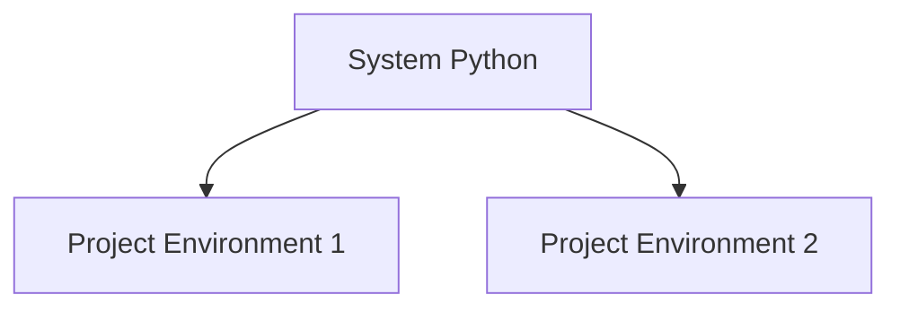

# pip and PyPI

Python has a large ecosystem of third-party libraries.

These libraries are distributed through **PyPI** and installed using **pip**.

```mermaid
flowchart LR
    A[Developer]
    A --> B[pip install]
    B --> C[PyPI repository]
    C --> D[Local Python environment]
````

---

## 1. What Is PyPI?

PyPI (Python Package Index) is an online repository of Python packages.

It contains thousands of libraries for:

* data science
* web development
* networking
* machine learning
* scientific computing

Examples include:

* `requests`
* `numpy`
* `pandas`
* `flask`

---

## 2. What Is pip?

`pip` is the standard Python package manager.

It downloads and installs packages from PyPI.

Example command:

```bash
pip install requests
```

---

## 3. Installing Packages

Example:

```bash
pip install numpy
```

After installation, the module can be imported.

```python
import numpy
```

---

## 4. Listing Installed Packages

```bash
pip list
```

This shows all installed packages.

---

## 5. Updating Packages

```bash
pip install --upgrade numpy
```

---

## 6. Virtual Environments (Conceptual Overview)

Projects often use **virtual environments** to isolate dependencies.



Each project can have its own package versions.

---

## 7. Worked Example

Install the `requests` library:

```bash
pip install requests
```

Use it in Python:

```python
import requests

response = requests.get("https://example.com")
print(response.status_code)
```

---


## 8. Summary

Key ideas:

* PyPI is the central repository of Python packages
* pip installs and manages packages
* third-party libraries expand Python’s capabilities
* virtual environments isolate project dependencies

Package managers make it easy to reuse and distribute Python software.


## Exercises

**Exercise 1.**
A programmer installs packages globally and encounters version conflicts between two projects:

Project A requires `numpy==1.24` and Project B requires `numpy==1.26`. Explain why installing packages globally causes this conflict. How do virtual environments solve it? What command creates a virtual environment?

??? success "Solution to Exercise 1"
    Global installation stores one version of each package. If Project A needs `numpy==1.24` and Project B needs `numpy==1.26`, installing one breaks the other -- they share the same installation directory.

    Virtual environments solve this by creating **isolated Python installations**. Each environment has its own `site-packages` directory, so Project A and Project B each have their own `numpy` version.

    Commands:

    ```bash
    python -m venv myenv          # Create virtual environment
    source myenv/bin/activate     # Activate (Unix/macOS)
    myenv\Scripts\activate        # Activate (Windows)
    pip install numpy==1.24       # Install in this environment only
    ```

    Each virtual environment is a directory containing a Python interpreter and its own package library. Activating an environment modifies `PATH` so that `python` and `pip` point to the environment's versions.

---

**Exercise 2.**
`pip install requests` downloads and installs a package, but where does it go? Explain what `pip` does during installation: where are the files placed, how does Python find them later (via `sys.path`), and what happens if you install a package in one virtual environment but try to import it in another?

??? success "Solution to Exercise 2"
    When `pip install requests` runs:

    1. `pip` downloads the package from PyPI (or a local cache).
    2. It installs the package files into the `site-packages` directory of the active Python environment (e.g., `/usr/lib/python3.12/site-packages/` or `.venv/lib/python3.12/site-packages/`).
    3. It installs any dependencies the package requires.

    Python finds installed packages via `sys.path` -- a list of directories Python searches when you write `import requests`. The `site-packages` directory is included in `sys.path` by default.

    If you install a package in one virtual environment but activate a different one, `import requests` raises `ModuleNotFoundError` because the other environment's `site-packages` does not contain `requests`. Each virtual environment has its own independent `sys.path`.

---

**Exercise 3.**
A programmer shares their project with a colleague but the colleague cannot run it because packages are missing. Explain the purpose of `requirements.txt`:

```text
requests==2.31.0
numpy>=1.24,<2.0
flask~=3.0
```

What do the version specifiers `==`, `>=,<`, and `~=` mean? Why is pinning exact versions (`==`) important for reproducibility? What command generates and installs from a requirements file?

??? success "Solution to Exercise 3"
    Version specifiers:

    - `==2.31.0`: **exact match** -- only this specific version is acceptable.
    - `>=1.24,<2.0`: **compatible range** -- any version from 1.24 up to (but not including) 2.0.
    - `~=3.0`: **compatible release** -- equivalent to `>=3.0,<4.0`. Allows patch and minor updates within the major version.

    Pinning exact versions (`==`) is important for reproducibility because it ensures everyone gets identical package versions. Without pinning, `pip install numpy` might install different versions on different machines (depending on when they install), leading to subtle behavior differences or broken code.

    Commands:

    ```bash
    pip freeze > requirements.txt     # Generate from current environment
    pip install -r requirements.txt   # Install from file
    ```

    `pip freeze` lists all installed packages with exact versions. `pip install -r` reads the file and installs everything listed.
