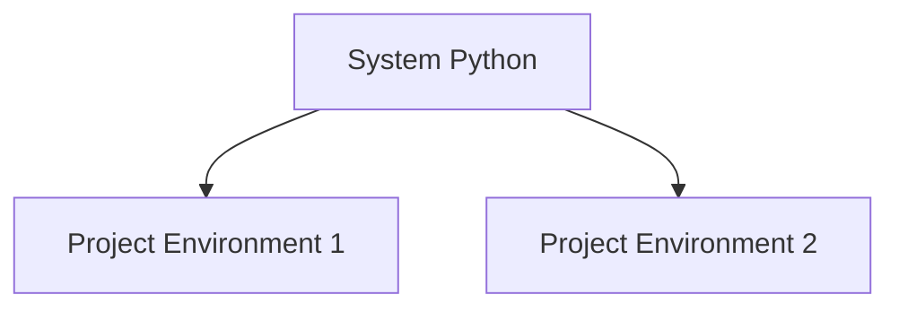

# pip and PyPI

Python has a large ecosystem of third-party libraries.

These libraries are distributed through **PyPI** and installed using **pip**.

```mermaid
flowchart LR
    A[Developer]
    A --> B[pip install]
    B --> C[PyPI repository]
    C --> D[Local Python environment]
````

---

## 1. What Is PyPI?

PyPI (Python Package Index) is an online repository of Python packages.

It contains thousands of libraries for:

* data science
* web development
* networking
* machine learning
* scientific computing

Examples include:

* `requests`
* `numpy`
* `pandas`
* `flask`

---

## 2. What Is pip?

`pip` is the standard Python package manager.

It downloads and installs packages from PyPI.

Example command:

```bash
pip install requests
```

---

## 3. Installing Packages

Example:

```bash
pip install numpy
```

After installation, the module can be imported.

```python
import numpy
```

---

## 4. Listing Installed Packages

```bash
pip list
```

This shows all installed packages.

---

## 5. Updating Packages

```bash
pip install --upgrade numpy
```

---

## 6. Virtual Environments (Conceptual Overview)

Projects often use **virtual environments** to isolate dependencies.



Each project can have its own package versions.

---

## 7. Worked Example

Install the `requests` library:

```bash
pip install requests
```

Use it in Python:

```python
import requests

response = requests.get("https://example.com")
print(response.status_code)
```

---

## 8. Summary

Key ideas:

* PyPI is the central repository of Python packages
* pip installs and manages packages
* third-party libraries expand Python’s capabilities
* virtual environments isolate project dependencies

Package managers make it easy to reuse and distribute Python software.

