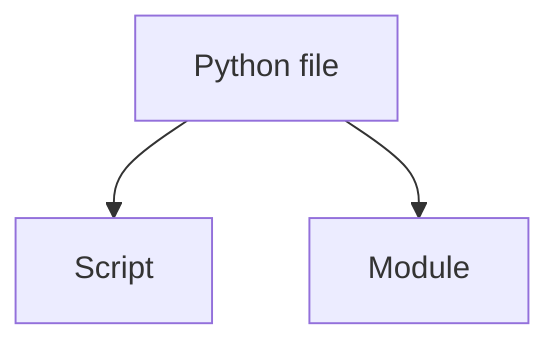
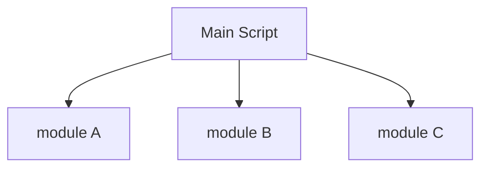

# Scripts vs Modules

Python files can serve two different roles:

* scripts
* modules

Understanding this distinction helps structure programs effectively.



---

## 1. What Is a Script?

A script is a program intended to be executed directly.

Example:

```python
print("Hello, world")
```

Running the file executes the code immediately.

Scripts are commonly used for:

* automation
* quick utilities
* data processing tasks

---

## 2. What Is a Module?

A module is a file designed primarily for **reuse**.

It provides functions, classes, or variables that other programs import.

Example module:

```python
def add(a, b):
    return a + b
```

Used in another file:

```python
import math_utils
```

---

## 3. Scripts and Modules Together

A Python file can act as both a script and a module.

This is typically done with the main guard.

```python
def greet():
    print("hello")

if __name__ == "__main__":
    greet()
```

---

## 4. Organizing Larger Programs

Programs often consist of many modules.



This modular structure improves readability and maintainability.

---

## 5. Advantages of Modules

Modules provide several benefits:

* code reuse
* separation of concerns
* easier debugging
* clearer program organization

Large software systems rely heavily on modular structure.

---

## 6. Worked Example

File `math_utils.py`

```python
def square(x):
    return x * x
```

Main script:

```python
import math_utils

print(math_utils.square(6))
```

Output:

```text
36
```

---

## 7. Summary

Key ideas:

* scripts are programs executed directly
* modules contain reusable definitions
* Python files can serve both roles
* modular design improves program structure

Modules are essential for building larger and maintainable programs.
