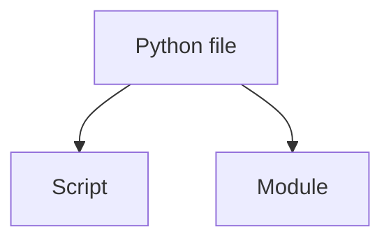
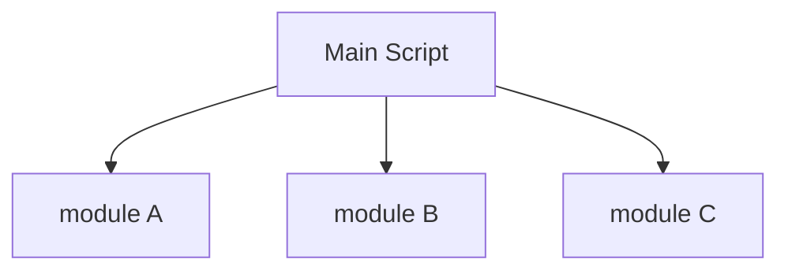

# Scripts vs Modules

Python files can serve two different roles:

* scripts
* modules

Understanding this distinction helps structure programs effectively.



---

## 1. What Is a Script?

A script is a program intended to be executed directly.

Example:

```python
print("Hello, world")
```

Running the file executes the code immediately.

Scripts are commonly used for:

* automation
* quick utilities
* data processing tasks

---

## 2. What Is a Module?

A module is a file designed primarily for **reuse**.

It provides functions, classes, or variables that other programs import.

Example module:

```python
def add(a, b):
    return a + b
```

Used in another file:

```python
import math_utils
```

---

## 3. Scripts and Modules Together

A Python file can act as both a script and a module.

This is typically done with the main guard.

```python
def greet():
    print("hello")

if __name__ == "__main__":
    greet()
```

---

## 4. Organizing Larger Programs

Programs often consist of many modules.



This modular structure improves readability and maintainability.

---

## 5. Advantages of Modules

Modules provide several benefits:

* code reuse
* separation of concerns
* easier debugging
* clearer program organization

Large software systems rely heavily on modular structure.

---

## 6. Worked Example

File `math_utils.py`

```python
def square(x):
    return x * x
```

Main script:

```python
import math_utils

print(math_utils.square(6))
```

Output:

```text
36
```

---


## 7. Summary

Key ideas:

* scripts are programs executed directly
* modules contain reusable definitions
* Python files can serve both roles
* modular design improves program structure

Modules are essential for building larger and maintainable programs.


## Exercises

**Exercise 1.**
A Python file can be both a script and a module. Explain the practical implications: if `math_utils.py` contains top-level code like `print("loaded")`, what happens when (a) you run it as a script, and (b) another program imports it? Why is this a problem for modular design?

??? success "Solution to Exercise 1"
    - **(a)** Running as a script: `"loaded"` prints, then any other code executes.
    - **(b)** Importing: `"loaded"` ALSO prints, because Python executes the module file when importing it for the first time.

    This is a problem for modular design because the importer does not want side effects -- they just want access to functions and variables. The solution is the main guard:

    ```python
    if __name__ == "__main__":
        print("loaded")
    ```

    A clean module should only **define** things (functions, classes, constants) at the top level. Any executable code (printing, launching servers, processing data) should be inside the main guard.

---

**Exercise 2.**
A programmer organizes a project with three files:

```python
# config.py
DEBUG = True
DB_HOST = "localhost"

# utils.py
from config import DEBUG
def log(msg):
    if DEBUG:
        print(msg)

# main.py
from utils import log
log("starting")
```

Explain the import chain. How many times is `config.py` executed? What Python mechanism prevents it from being executed multiple times? What happens if `config.py` modifies a global variable each time it runs?

??? success "Solution to Exercise 2"
    Import chain: `main.py` imports `utils.py`, which imports `config.py`. Python executes each module when first imported.

    `config.py` is executed **exactly once**. Python caches imported modules in `sys.modules`. When `main.py` imports `utils`, and `utils` imports `config`, Python stores `config` in the cache. If any other module later imports `config`, Python returns the cached version without re-executing the file.

    If `config.py` modified a global variable each time (e.g., `counter += 1`), this would only happen once because the module is only executed once. All importers share the **same** module object, seeing the same `DEBUG` and `DB_HOST` values.

---

**Exercise 3.**
Explain the difference between a module, a package, and a script. For each of the following, identify which role the Python file plays:

1. `app.py` that you run with `python app.py`
2. `helpers.py` that defines utility functions and is imported by `app.py`
3. A directory `mypackage/` containing `__init__.py` and `core.py`

Why did Python add the concept of packages? What problem do they solve that simple modules cannot?

??? success "Solution to Exercise 3"
    1. `app.py` run with `python app.py`: **script** -- it is the entry point of the program.
    2. `helpers.py` imported by `app.py`: **module** -- it provides reusable definitions.
    3. `mypackage/` with `__init__.py`: **package** -- a directory containing modules, organized as a namespace.

    Python added packages to solve the **namespace collision** problem. With only flat modules, every module name must be globally unique. If two libraries both define a `utils.py`, they conflict. Packages create hierarchical namespaces: `library_a.utils` and `library_b.utils` can coexist.

    Packages also provide **organizational structure** for large projects. A project with 50 modules benefits from grouping related modules into packages (e.g., `myapp.database`, `myapp.api`, `myapp.models`) rather than having 50 files in a single directory.
