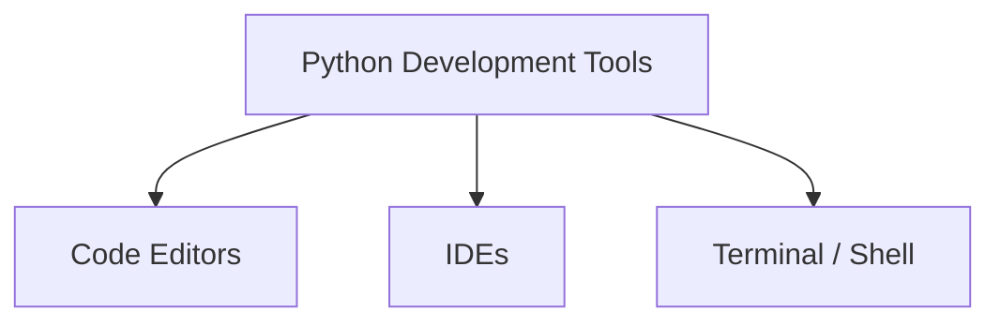

# Development Tools

Writing Python programs becomes much easier with the help of appropriate development tools.
These tools provide environments for editing code, running programs, debugging errors, and managing projects.

Common categories of Python development tools include:

* **code editors**
* **integrated development environments (IDEs)**
* **terminal or command-line interfaces**



Each tool plays a different role in the Python development workflow.

---

## 1. Code Editors

A **code editor** is a lightweight program used to write and edit source code.

Unlike simple text editors, modern code editors provide features designed specifically for programming.

Examples of popular editors include:

| Editor       | Description                               |
| ------------ | ----------------------------------------- |
| VS Code      | widely used modern editor with extensions |
| Sublime Text | fast and minimal editor                   |
| Notepad++    | simple and lightweight Windows editor     |

Most editors provide features such as:

* syntax highlighting
* automatic indentation
* auto-completion
* plugin and extension support

Example of Python code inside an editor:

```python
for i in range(3):
    print(i)
```

These tools help programmers write and read code more efficiently.

---

## 2. Integrated Development Environments (IDEs)

An **Integrated Development Environment (IDE)** provides a more comprehensive programming environment than a simple editor.

IDEs typically combine:

* code editing
* debugging tools
* project management
* testing utilities

Examples of Python IDEs include:

| IDE     | Description                                            |
| ------- | ------------------------------------------------------ |
| PyCharm | full-featured professional Python IDE                  |
| Spyder  | scientific computing IDE commonly used in data science |
| Thonny  | beginner-friendly IDE designed for learning Python     |

Typical IDE capabilities include:

* code navigation
* integrated debugging tools
* variable inspection
* project organization

Because IDEs integrate many tools into one interface, they are often preferred for large or complex projects.

---

## 3. Running Python from the Terminal

Python programs can also be executed directly from the command line.

Example command:

```bash
python hello.py
```

This command tells the Python interpreter to execute the script `hello.py`.

Running programs from the terminal is useful for:

* testing scripts quickly
* running automation tools
* executing programs on remote systems

Many developers regularly switch between an editor and the terminal while developing software.

---

## 4. Creating and Running a Python Script

A **Python script** is simply a file containing Python code.

Example file `hello.py`:

```python
print("Hello Python")
```

Run the script from the terminal:

```bash
python hello.py
```

Output:

```
Hello Python
```

Scripts allow Python programs to be stored and reused.

---

## 5. Version Control Tools

Most professional software projects use **version control systems**.

Version control tools track changes in code over time and allow developers to collaborate effectively.

The most widely used system is **Git**.

Benefits of version control include:

* tracking changes to files
* collaborating with other developers
* maintaining a history of project versions
* reverting to previous versions if needed

Git is commonly used together with platforms such as:

* GitHub
* GitLab
* Bitbucket

These platforms host code repositories and support collaborative development.

---

## 6. Summary

Key ideas from this section:

* development tools help programmers write, run, and manage code
* **code editors** provide lightweight environments for writing programs
* **IDEs** offer integrated tools for debugging and project management
* Python programs can be run from the **terminal**
* **version control systems** such as Git help manage software projects

Choosing the right development tools can significantly improve productivity and code organization when working with Python programs.

## Exercises

**Exercise 1.**
Create a Python script called `hello_tools.py` that prints `"Development tools are ready!"`. Run it from the terminal and write down the exact command you used.

??? success "Solution to Exercise 1"
    File `hello_tools.py`:

    ```python
    print("Development tools are ready!")
    ```

    Run from the terminal:

    ```bash
    python hello_tools.py
    ```

    Output:

    ```
    Development tools are ready!
    ```

    On some systems, `python3 hello_tools.py` is required. The command tells the Python interpreter to execute the script file.

---

**Exercise 2.**
List three features that distinguish an IDE from a simple code editor. For each feature, explain how it helps a programmer.

??? success "Solution to Exercise 2"
    Three distinguishing features of an IDE:

    1. **Integrated debugger** -- allows stepping through code line by line, inspecting variable values, and setting breakpoints. This helps locate bugs without adding `print` statements everywhere.

    2. **Project management** -- organizes multiple files and directories into a unified project view with navigation tools. This helps manage large codebases with many modules.

    3. **Built-in testing utilities** -- runs unit tests directly within the environment and displays results. This helps ensure code correctness without switching to the terminal.

    A simple code editor typically provides syntax highlighting and basic auto-completion but lacks these deeper integration features.

---

**Exercise 3.**
Explain the difference between running a Python program from the terminal versus running it inside an IDE. Are the results always the same?

??? success "Solution to Exercise 3"
    When running from the terminal, you invoke the Python interpreter directly:

    ```bash
    python script.py
    ```

    The program runs in the terminal's environment, using whatever Python version and PATH settings are configured in the shell.

    When running inside an IDE, the IDE invokes the Python interpreter on your behalf, often with its own configured Python path, working directory, and environment variables.

    The results are usually the same if both use the same Python interpreter and environment. However, differences can arise when:

    - The IDE uses a different Python version than the terminal default.
    - The working directory differs (affecting relative file paths).
    - The IDE sets environment variables that the terminal does not, or vice versa.
    - The IDE's console handles input/output differently (e.g., buffering or encoding).

---

**Exercise 4.**
A teammate recommends using version control for a Python project. Explain what **version control** is and give two concrete benefits of using Git for a Python project.

??? success "Solution to Exercise 4"
    **Version control** is a system that records changes to files over time. Each set of changes is saved as a snapshot (a "commit"), creating a complete history of the project.

    Two concrete benefits of using Git:

    1. **Reversibility** -- if a change introduces a bug, you can revert to a previous working version of the code. For example, `git checkout` or `git revert` can undo problematic changes without manually reconstructing the old code.

    2. **Collaboration** -- multiple developers can work on the same project simultaneously. Git tracks each person's changes independently and provides tools (`merge`, `rebase`) to combine them. This prevents accidental overwrites when two people edit the same file.

---

**Exercise 5.**
You have a Python script that works on your machine but fails on a colleague's machine with the error `ModuleNotFoundError`. The script uses `import requests`. Explain the most likely cause and describe how a development tool or workflow could prevent this problem.

??? success "Solution to Exercise 5"
    The most likely cause is that the `requests` library is installed in your Python environment but not in your colleague's environment. Third-party packages must be installed separately on each machine.

    Prevention strategies:

    - **Requirements file**: maintain a `requirements.txt` listing all dependencies (e.g., `requests==2.31.0`). Your colleague runs `pip install -r requirements.txt` to install the same packages.
    - **Virtual environments**: use `python -m venv` or a tool like `conda` to create isolated environments. This ensures the project's dependencies are explicit and reproducible.
    - **IDE integration**: many IDEs (e.g., PyCharm, VS Code) detect missing imports and prompt the user to install them, reducing the chance of shipping code with unmet dependencies.
