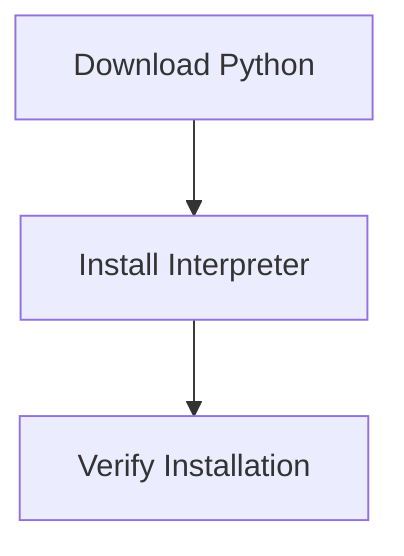

# Installing Python

Before writing and running Python programs, the Python interpreter must be installed on your system.

Python distributions can be downloaded from the official Python website:

```
https://www.python.org
```

The installation process typically involves three main steps:

1. downloading the Python installer
2. installing the interpreter
3. verifying that the installation works



Once Python is installed successfully, programs can be executed from the terminal or through development tools.

---

## 1. Installing on Windows

Installing Python on Windows usually involves running a graphical installer.

### Steps

1. Download the installer from the official Python website.
2. Run the installer executable.
3. Enable the **Add Python to PATH** option.
4. Complete the installation process.

Adding Python to the system **PATH** allows Python to be executed from the command prompt.

### Verifying the Installation

Open the command prompt and run:

```bash
python --version
```

If installation was successful, the interpreter prints the installed version:

```
Python 3.x.x
```

---

## 2. Installing on macOS

Some versions of macOS include Python by default, but installing the latest version is recommended.

### Steps

1. Download the macOS installer from the official Python website.
2. Run the `.pkg` installation file.
3. Follow the installation instructions.

### Verifying the Installation

Open the terminal and run:

```bash
python3 --version
```

If Python is installed correctly, the terminal displays the installed version number.

---

## 3. Installing on Linux

Most Linux distributions include Python as part of the operating system.

However, Python can also be installed or updated using the system package manager.

Example for Ubuntu-based systems:

```bash
sudo apt install python3
```

### Verifying the Installation

Run:

```bash
python3 --version
```

This confirms that Python is installed and available.

---

## 4. Starting the Python Interpreter

After installation, the Python interpreter can be started from the terminal.

Example:

```bash
python
```

or

```bash
python3
```

If successful, the interpreter starts an interactive session.

Example:

```
Python 3.x.x
>>>
```

The `>>>` prompt indicates that Python is ready to execute commands.

---

## 5. Example Interpreter Session

The interpreter allows immediate execution of Python expressions.

Example:

```python
>>> print("Hello Python")
```

Output:

```
Hello Python
```

This interactive mode is useful for testing small pieces of code.

---

## 6. Updating Python

Python is actively maintained and improved.

New versions typically include:

* performance improvements
* bug fixes
* security updates
* new language features

Updating Python periodically ensures access to the latest capabilities.

---

## 7. Summary

Key ideas from this section:

* Python must be installed before writing and running programs.
* Installation steps differ slightly across operating systems.
* The interpreter can be verified using the `python --version` command.
* After installation, Python can be launched from the terminal.
* Keeping Python updated helps maintain security and performance.

Once Python is installed and verified, the next step is learning how to interact with the interpreter and run Python programs.
