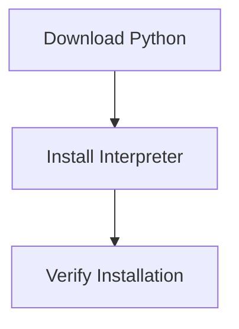

# Installing Python

Before writing and running Python programs, the Python interpreter must be installed on your system.

Python distributions can be downloaded from the official Python website:

```
https://www.python.org
```

The installation process typically involves three main steps:

1. downloading the Python installer
2. installing the interpreter
3. verifying that the installation works



Once Python is installed successfully, programs can be executed from the terminal or through development tools.

---

## 1. Installing on Windows

Installing Python on Windows usually involves running a graphical installer.

### Steps

1. Download the installer from the official Python website.
2. Run the installer executable.
3. Enable the **Add Python to PATH** option.
4. Complete the installation process.

Adding Python to the system **PATH** allows Python to be executed from the command prompt.

### Verifying the Installation

Open the command prompt and run:

```bash
python --version
```

If installation was successful, the interpreter prints the installed version:

```
Python 3.x.x
```

---

## 2. Installing on macOS

Some versions of macOS include Python by default, but installing the latest version is recommended.

### Steps

1. Download the macOS installer from the official Python website.
2. Run the `.pkg` installation file.
3. Follow the installation instructions.

### Verifying the Installation

Open the terminal and run:

```bash
python3 --version
```

If Python is installed correctly, the terminal displays the installed version number.

---

## 3. Installing on Linux

Most Linux distributions include Python as part of the operating system.

However, Python can also be installed or updated using the system package manager.

Example for Ubuntu-based systems:

```bash
sudo apt install python3
```

### Verifying the Installation

Run:

```bash
python3 --version
```

This confirms that Python is installed and available.

---

## 4. Starting the Python Interpreter

After installation, the Python interpreter can be started from the terminal.

Example:

```bash
python
```

or

```bash
python3
```

If successful, the interpreter starts an interactive session.

Example:

```
Python 3.x.x
>>>
```

The `>>>` prompt indicates that Python is ready to execute commands.

---

## 5. Example Interpreter Session

The interpreter allows immediate execution of Python expressions.

Example:

```python
>>> print("Hello Python")
```

Output:

```
Hello Python
```

This interactive mode is useful for testing small pieces of code.

---

## 6. Updating Python

Python is actively maintained and improved.

New versions typically include:

* performance improvements
* bug fixes
* security updates
* new language features

Updating Python periodically ensures access to the latest capabilities.

---

## 7. Summary

Key ideas from this section:

* Python must be installed before writing and running programs.
* Installation steps differ slightly across operating systems.
* The interpreter can be verified using the `python --version` command.
* After installation, Python can be launched from the terminal.
* Keeping Python updated helps maintain security and performance.

Once Python is installed and verified, the next step is learning how to interact with the interpreter and run Python programs.

## Exercises

**Exercise 1.**
Open a terminal and run `python --version` (or `python3 --version`). Write down the exact version string that is printed. What do the three numbers in the version string represent?

??? success "Solution to Exercise 1"
    Example output:

    ```
    Python 3.12.4
    ```

    The three numbers represent:

    - **3** -- the **major** version. Python 3 is the current major release.
    - **12** -- the **minor** version. Each minor release adds new features while maintaining backward compatibility within the major version.
    - **4** -- the **patch** version (also called micro version). Patch releases contain bug fixes and security updates without new features.

    This numbering follows **semantic versioning** conventions.

---

**Exercise 2.**
Explain why the "Add Python to PATH" option is important during Windows installation. What happens if this option is not selected?

??? success "Solution to Exercise 2"
    The **PATH** is an environment variable that tells the operating system where to look for executable programs. When Python is added to PATH, the `python` command can be run from any directory in the command prompt.

    If this option is not selected:

    - Typing `python` in the command prompt produces an error like `'python' is not recognized as an internal or external command`.
    - The user must either navigate to the Python installation directory every time or manually add the Python directory to the PATH environment variable after installation.
    - Tools like `pip` (the package installer) will also not be accessible from the command line.

    Selecting "Add Python to PATH" during installation avoids all of these issues.

---

**Exercise 3.**
A student has both Python 2.7 and Python 3.11 installed. When they type `python` in the terminal, Python 2.7 starts. How can they verify which Python version runs by default, and how can they ensure Python 3.11 is used?

??? success "Solution to Exercise 3"
    To verify the default version:

    ```bash
    python --version
    ```

    If this shows `Python 2.7.x`, the default `python` command points to Python 2.

    To use Python 3.11 specifically:

    ```bash
    python3 --version
    ```

    This should show `Python 3.11.x`. Use `python3` instead of `python` when running scripts:

    ```bash
    python3 script.py
    ```

    On some systems, `python3.11` can be used to target a specific minor version. Alternatively, the user can update their system PATH so that Python 3.11 appears before Python 2.7, or use a **virtual environment** created with `python3.11 -m venv myenv` to ensure the correct version.

---

**Exercise 4.**
After installing Python, write and run a one-line script that verifies the installation is working. The script should print the Python version from within the program itself (not from the command line).

??? success "Solution to Exercise 4"
    ```python
    import sys
    print(sys.version)
    ```

    Example output:

    ```
    3.12.4 (main, Jun  6 2024, 18:26:44) [GCC 11.4.0]
    ```

    The `sys.version` attribute contains the full version string including build details. For just the version number, use `sys.version_info`:

    ```python
    import sys
    print(f"{sys.version_info.major}.{sys.version_info.minor}.{sys.version_info.micro}")
    ```

    Output:

    ```
    3.12.4
    ```

---

**Exercise 5.**
Explain the difference between installing Python from the official website (python.org) versus installing it through a package manager like `apt` on Linux or Homebrew on macOS. What are the trade-offs of each approach?

??? success "Solution to Exercise 5"
    **Official website (python.org):**

    - Provides the latest release directly from the Python Software Foundation.
    - Offers a graphical installer on Windows and macOS.
    - The user has full control over the exact version installed.
    - Updates must be downloaded and installed manually.

    **Package manager (`apt`, Homebrew, etc.):**

    - Integrates with the operating system's update mechanism, so Python can be updated alongside other system packages.
    - Installation is typically one command: `sudo apt install python3` or `brew install python`.
    - The available version may lag behind the latest release, since package repositories follow their own update schedules.
    - On Linux, the system Python is often used by OS tools, so upgrading it carelessly can break system utilities.

    **Trade-offs:** The official installer gives access to the newest version with more control, while package managers offer convenience and automatic updates but may not have the latest release. Many developers install from the official source (or use tools like `pyenv`) when they need a specific version, and rely on the system package manager for general use.
