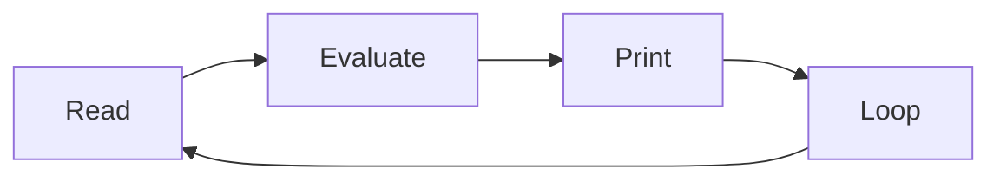
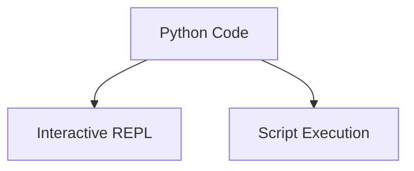

# Python Interpreter and Read–Eval–Print Loop

Python programs run inside a program called the **Python interpreter**.

The interpreter reads Python code, executes it, and produces results.
Python also provides an interactive execution environment known as the **REPL**.

REPL stands for:

* **Read**
* **Evaluate**
* **Print**
* **Loop**



This cycle allows Python to execute commands interactively.

---

## 1. Starting the Interpreter

The Python interpreter can be started from the terminal or command prompt.

Typical commands:

```bash
python
```

or

```bash
python3
```

If Python starts successfully, a prompt appears:

```
>>>
```

This prompt indicates that Python is ready to receive commands.

Example:

```python
>>> 2 + 3
5
```

The interpreter immediately evaluates the expression and prints the result.

---

## 2. Basic REPL Interaction

The REPL allows users to enter Python statements and expressions interactively.

Example:

```python
>>> x = 10
>>> x * 2
20
```

Each command is executed as soon as it is entered.

This interactive execution makes it easy to test ideas and explore the language.

---

## 3. Using the REPL for Exploration

The REPL is especially useful for:

* experimenting with code
* testing expressions
* learning language features
* exploring modules

Example:

```python
>>> import math
>>> math.sqrt(25)
5.0
```

This quick feedback makes the REPL a powerful learning and debugging tool.

---

## 4. Exiting the Interpreter

The interpreter session can be exited using the `exit()` function:

```python
exit()
```

Keyboard shortcuts may also be used:

| System        | Shortcut              |
| ------------- | --------------------- |
| Linux / macOS | `Ctrl + D`            |
| Windows       | `Ctrl + Z` then Enter |

After exiting, control returns to the operating system shell.

---

## 5. REPL vs Script Execution

Python programs can be executed in two primary ways.

| Method | Description                  |
| ------ | ---------------------------- |
| REPL   | interactive experimentation  |
| Script | running a saved program file |



The REPL is useful for quick testing, while scripts are used for larger programs.

---

## 6. Example Script

A Python program can be saved as a file and executed by the interpreter.

Example file: **`square.py`**

```python
x = int(input("Number: "))
print(x * x)
```

Run the script from the terminal:

```bash
python square.py
```

Example interaction:

```
Number: 5
25
```

Scripts allow programs to be reused and shared.

---

## 7. Summary

Key ideas from this section:

* the Python interpreter executes Python code
* the **REPL** provides an interactive programming environment
* expressions entered in the REPL are evaluated immediately
* Python programs can also be saved and executed as **scripts**
* both REPL interaction and script execution are important development tools

The interpreter is the core component that allows Python programs to run and produce results.
