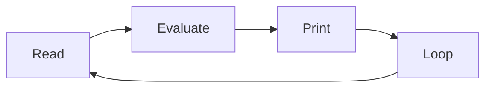
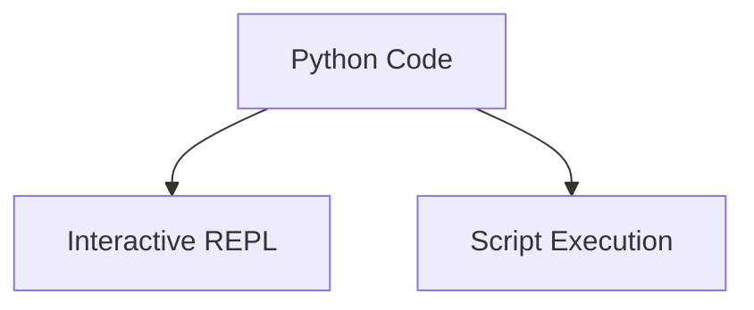

# Python Interpreter and Read–Eval–Print Loop

Python programs run inside a program called the **Python interpreter**.

The interpreter reads Python code, executes it, and produces results.
Python also provides an interactive execution environment known as the **REPL**.

REPL stands for:

* **Read**
* **Evaluate**
* **Print**
* **Loop**



This cycle allows Python to execute commands interactively.

---

## 1. Starting the Interpreter

The Python interpreter can be started from the terminal or command prompt.

Typical commands:

```bash
python
```

or

```bash
python3
```

If Python starts successfully, a prompt appears:

```
>>>
```

This prompt indicates that Python is ready to receive commands.

Example:

```python
>>> 2 + 3
5
```

The interpreter immediately evaluates the expression and prints the result.

---

## 2. Basic REPL Interaction

The REPL allows users to enter Python statements and expressions interactively.

Example:

```python
>>> x = 10
>>> x * 2
20
```

Each command is executed as soon as it is entered.

This interactive execution makes it easy to test ideas and explore the language.

---

## 3. Using the REPL for Exploration

The REPL is especially useful for:

* experimenting with code
* testing expressions
* learning language features
* exploring modules

Example:

```python
>>> import math
>>> math.sqrt(25)
5.0
```

This quick feedback makes the REPL a powerful learning and debugging tool.

---

## 4. Exiting the Interpreter

The interpreter session can be exited using the `exit()` function:

```python
exit()
```

Keyboard shortcuts may also be used:

| System        | Shortcut              |
| ------------- | --------------------- |
| Linux / macOS | `Ctrl + D`            |
| Windows       | `Ctrl + Z` then Enter |

After exiting, control returns to the operating system shell.

---

## 5. REPL vs Script Execution

Python programs can be executed in two primary ways.

| Method | Description                  |
| ------ | ---------------------------- |
| REPL   | interactive experimentation  |
| Script | running a saved program file |



The REPL is useful for quick testing, while scripts are used for larger programs.

---

## 6. Example Script

A Python program can be saved as a file and executed by the interpreter.

Example file: **`square.py`**

```python
x = int(input("Number: "))
print(x * x)
```

Run the script from the terminal:

```bash
python square.py
```

Example interaction:

```
Number: 5
25
```

Scripts allow programs to be reused and shared.

---

## 7. Summary

Key ideas from this section:

* the Python interpreter executes Python code
* the **REPL** provides an interactive programming environment
* expressions entered in the REPL are evaluated immediately
* Python programs can also be saved and executed as **scripts**
* both REPL interaction and script execution are important development tools

The interpreter is the core component that allows Python programs to run and produce results.

## Exercises

**Exercise 1.**
Start the Python REPL and evaluate the following expressions. Write down the result of each.

```python
>>> 2 ** 10
>>> 15 // 4
>>> 15 % 4
>>> type("hello")
```

??? success "Solution to Exercise 1"
    ```python
    >>> 2 ** 10
    1024
    >>> 15 // 4
    3
    >>> 15 % 4
    3
    >>> type("hello")
    <class 'str'>
    ```

    `2 ** 10` is exponentiation ($2^{10} = 1024$). `15 // 4` is floor division (integer quotient). `15 % 4` is the modulo (remainder). `type("hello")` returns the type of the string object.

---

**Exercise 2.**
In the REPL, enter `x = 42` and then enter `x` on the next line. Now enter `print(x)`. Both display `42`, but in different ways. Explain the difference.

??? success "Solution to Exercise 2"
    ```python
    >>> x = 42
    >>> x
    42
    >>> print(x)
    42
    ```

    When you type `x` alone, the REPL evaluates the expression and displays its **repr** (representation). For integers, the repr is the same as the string form, so you see `42`.

    When you type `print(x)`, the `print` function writes the **str** form of `x` to standard output. The `print` call itself returns `None`, which the REPL does not display.

    The difference becomes visible with strings:

    ```python
    >>> s = "hello"
    >>> s
    'hello'
    >>> print(s)
    hello
    ```

    The bare expression shows quotes (repr), while `print` shows the content without quotes (str).

---

**Exercise 3.**
Explain what REPL stands for. Describe what happens at each of the four stages when you type `3 + 4` into the Python interpreter.

??? success "Solution to Exercise 3"
    REPL stands for **Read-Eval-Print-Loop**:

    1. **Read** -- The interpreter reads the input `3 + 4` from the user.
    2. **Eval(uate)** -- The interpreter evaluates the expression. It parses `3 + 4` as an addition operation and computes the result `7`.
    3. **Print** -- The interpreter prints the result `7` to the screen.
    4. **Loop** -- The interpreter returns to the `>>>` prompt and waits for the next input, repeating the cycle.

    This cycle continues until the user exits the interpreter with `exit()` or a keyboard shortcut.

---

**Exercise 4.**
Write a script `square.py` that asks the user for a number, computes its square, and prints the result. Then explain how the same task would differ if performed entirely in the REPL.

??? success "Solution to Exercise 4"
    File `square.py`:

    ```python
    x = int(input("Number: "))
    print(x * x)
    ```

    Run:

    ```bash
    python square.py
    ```

    Example interaction:

    ```
    Number: 7
    49
    ```

    In the REPL, the same task would be:

    ```python
    >>> x = int(input("Number: "))
    Number: 7
    >>> x * x
    49
    ```

    Key differences:

    - In a script, the entire program is saved in a file and can be rerun without retyping.
    - In the REPL, each line is typed and executed interactively, and the work is lost when the session ends.
    - The REPL automatically displays expression results, so `x * x` shows `49` without needing `print`. In a script, `print(x * x)` is required to produce output.

---

**Exercise 5.**
A student claims that "Python is a compiled language because it compiles code to bytecode." Another student says "Python is an interpreted language because it uses an interpreter." Who is correct? Explain Python's execution model and why this distinction is nuanced.

??? success "Solution to Exercise 5"
    Both students are partially correct. Python's execution involves two stages:

    1. **Compilation to bytecode** -- The Python interpreter first compiles source code into bytecode, a low-level, platform-independent representation. This bytecode is sometimes cached in `.pyc` files inside `__pycache__` directories.

    2. **Interpretation by the PVM** -- The Python Virtual Machine (PVM) then executes the bytecode instructions one at a time.

    Python is typically classified as an **interpreted language** because:

    - The compilation step is automatic, invisible to the user, and happens at runtime.
    - There is no separate compilation step that produces a standalone executable.
    - The bytecode is not machine code -- it still requires the PVM to execute.

    However, the compilation-to-bytecode step means Python is not purely interpreted in the way that some languages execute source code directly. This is why Python is sometimes described as a "compiled interpreted" or "bytecode interpreted" language. The practical takeaway is that Python handles compilation internally, so from the programmer's perspective, the workflow is that of an interpreted language.
