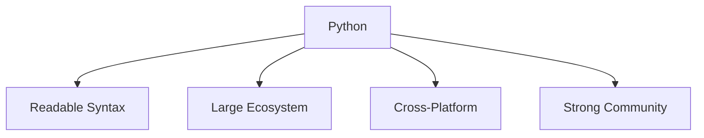

# Why Python

Python is a high-level programming language designed for **readability, simplicity, and productivity**.
Its clear syntax and extensive ecosystem make it one of the most widely used programming languages in the world.

Python is commonly used in areas such as:

* data science
* machine learning
* scientific computing
* web development
* automation
* education



Because of these characteristics, Python is often recommended as a first programming language while also remaining powerful enough for professional software development.

---

## 1. Readable Syntax

One of Python’s defining features is its emphasis on **code readability**.

Python programs are designed to be easy to read and understand, even for beginners.

Example:

```python
for i in range(3):
    print(i)
```

This code clearly expresses a loop that prints the numbers `0`, `1`, and `2`.

Compared with many other programming languages, Python syntax often resembles natural language, which helps programmers focus on solving problems rather than dealing with complicated syntax rules.

---

## 2. Large Standard Library

Python includes a large **standard library**, which provides built-in modules for many common programming tasks.

Examples of capabilities provided by the standard library include:

* file handling
* networking and internet communication
* data processing
* operating system interaction
* mathematical computations

Example:

```python
import math
print(math.sqrt(16))
```

Output:

```
4.0
```

Because many tools are already included, Python programs often require less code to accomplish common tasks.

---

## 3. Extensive Ecosystem

Beyond the standard library, Python has a massive ecosystem of **third-party packages**.

These libraries extend Python’s capabilities and support many specialized fields.

Examples include:

| Package    | Purpose                    |
| ---------- | -------------------------- |
| numpy      | numerical computing        |
| pandas     | data analysis              |
| matplotlib | plotting and visualization |
| flask      | web applications           |
| requests   | HTTP communication         |

These packages allow developers to build complex systems efficiently without writing everything from scratch.

---

## 4. Cross-Platform Compatibility

Python runs on many operating systems, including:

* Windows
* macOS
* Linux

Programs written in Python often run **without modification** across these systems.

This portability makes Python useful for:

* cross-platform applications
* cloud computing
* scientific computing environments

---

## 5. Python in Education

Python is widely used in programming education.

Reasons include:

* simple and readable syntax
* clear programming concepts
* immediate feedback through the interpreter

Students can focus on **algorithmic thinking and problem solving** rather than language complexity.

As a result, Python is commonly used in:

* universities
* coding bootcamps
* introductory programming courses

---

## 6. Example Program

The following short program demonstrates basic input and output.

```python
name = input("Enter your name: ")
print("Hello,", name)
```

Example interaction:

```
Enter your name: Alice
Hello, Alice
```

Even small Python programs can perform useful tasks with very little code.

---

## 7. Summary

Key ideas from this section:

* Python emphasizes **readability and simplicity**
* the language includes a large **standard library**
* thousands of **third-party libraries** extend Python’s capabilities
* Python programs run across many operating systems
* the language is widely used in both **education and industry**

Because of its clarity and flexibility, Python is an excellent language for beginners while remaining powerful enough for professional software development.
