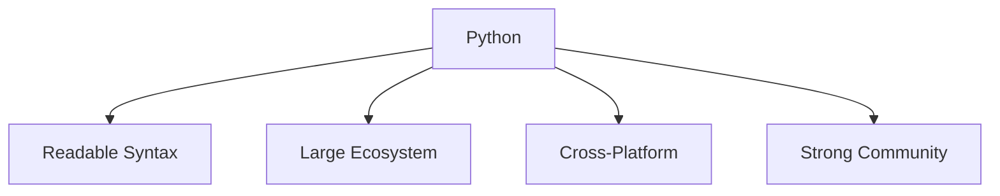

# Why Python

Python is a high-level programming language designed for **readability, simplicity, and productivity**.
Its clear syntax and extensive ecosystem make it one of the most widely used programming languages in the world.

Python is commonly used in areas such as:

* data science
* machine learning
* scientific computing
* web development
* automation
* education



Because of these characteristics, Python is often recommended as a first programming language while also remaining powerful enough for professional software development.

---

## 1. Readable Syntax

One of Python’s defining features is its emphasis on **code readability**.

Python programs are designed to be easy to read and understand, even for beginners.

Example:

```python
for i in range(3):
    print(i)
```

This code clearly expresses a loop that prints the numbers `0`, `1`, and `2`.

Compared with many other programming languages, Python syntax often resembles natural language, which helps programmers focus on solving problems rather than dealing with complicated syntax rules.

---

## 2. Large Standard Library

Python includes a large **standard library**, which provides built-in modules for many common programming tasks.

Examples of capabilities provided by the standard library include:

* file handling
* networking and internet communication
* data processing
* operating system interaction
* mathematical computations

Example:

```python
import math
print(math.sqrt(16))
```

Output:

```
4.0
```

Because many tools are already included, Python programs often require less code to accomplish common tasks.

---

## 3. Extensive Ecosystem

Beyond the standard library, Python has a massive ecosystem of **third-party packages**.

These libraries extend Python’s capabilities and support many specialized fields.

Examples include:

| Package    | Purpose                    |
| ---------- | -------------------------- |
| numpy      | numerical computing        |
| pandas     | data analysis              |
| matplotlib | plotting and visualization |
| flask      | web applications           |
| requests   | HTTP communication         |

These packages allow developers to build complex systems efficiently without writing everything from scratch.

---

## 4. Cross-Platform Compatibility

Python runs on many operating systems, including:

* Windows
* macOS
* Linux

Programs written in Python often run **without modification** across these systems.

This portability makes Python useful for:

* cross-platform applications
* cloud computing
* scientific computing environments

---

## 5. Python in Education

Python is widely used in programming education.

Reasons include:

* simple and readable syntax
* clear programming concepts
* immediate feedback through the interpreter

Students can focus on **algorithmic thinking and problem solving** rather than language complexity.

As a result, Python is commonly used in:

* universities
* coding bootcamps
* introductory programming courses

---

## 6. Example Program

The following short program demonstrates basic input and output.

```python
name = input("Enter your name: ")
print("Hello,", name)
```

Example interaction:

```
Enter your name: Alice
Hello, Alice
```

Even small Python programs can perform useful tasks with very little code.

---

## 7. Summary

Key ideas from this section:

* Python emphasizes **readability and simplicity**
* the language includes a large **standard library**
* thousands of **third-party libraries** extend Python’s capabilities
* Python programs run across many operating systems
* the language is widely used in both **education and industry**

Because of its clarity and flexibility, Python is an excellent language for beginners while remaining powerful enough for professional software development.

## Exercises

**Exercise 1.**
Write a Python program that imports the `math` module and prints the value of $\pi$ and $e$ to 10 decimal places. Use f-string formatting.

??? success "Solution to Exercise 1"
    ```python
    import math

    print(f"pi = {math.pi:.10f}")
    print(f"e  = {math.e:.10f}")
    ```

    Output:

    ```
    pi = 3.1415926536
    e  = 2.7182818285
    ```

    The `:.10f` format specifier displays the float with exactly 10 decimal places. This demonstrates Python's standard library providing mathematical constants without any external package.

---

**Exercise 2.**
Python is described as a "high-level" language. Explain what "high-level" means in the context of programming languages and give one advantage and one disadvantage compared to a "low-level" language like C.

??? success "Solution to Exercise 2"
    A **high-level language** provides abstractions that hide the details of the computer's hardware. Programmers work with concepts like lists, strings, and objects rather than memory addresses and CPU registers.

    **Advantage:** High-level languages are easier to read, write, and maintain. For example, creating a list in Python (`nums = [1, 2, 3]`) requires one line, while the equivalent in C requires manual memory allocation, pointer management, and size tracking.

    **Disadvantage:** High-level languages are generally slower than low-level languages. The abstractions add overhead. C programs can directly manipulate memory and compile to optimized machine code, making them significantly faster for performance-critical tasks like operating system kernels or embedded systems.

    Python's approach is to prioritize programmer productivity and readability, relying on optimized libraries (like NumPy, written in C) when performance is critical.

---

**Exercise 3.**
Compare the following Python code with its C equivalent. Identify three specific ways in which the Python version is simpler or more readable.

Python:
```python
for i in range(5):
    print(i)
```

C:
```c
#include <stdio.h>
int main() {
    for (int i = 0; i < 5; i++) {
        printf("%d\n", i);
    }
    return 0;
}
```

??? success "Solution to Exercise 3"
    Three ways the Python version is simpler:

    1. **No boilerplate** -- Python requires no `#include` directives, no `main` function declaration, and no `return 0`. The code expresses only the logic, not the scaffolding.

    2. **Simpler loop syntax** -- `for i in range(5)` reads almost like English. The C version requires initializing `i`, specifying the condition `i < 5`, and writing the increment `i++` separately.

    3. **No type declarations or format specifiers** -- Python's `print(i)` automatically handles the type. C requires declaring `int i` and using the format specifier `"%d\n"` in `printf` to specify integer formatting.

    The Python version is 2 lines; the C version is 7 lines (excluding blank lines). This difference in verbosity scales with program complexity.

---

**Exercise 4.**
Name three Python third-party packages and describe a practical task each one is used for. For each, write the `pip install` command needed to install it.

??? success "Solution to Exercise 4"
    1. **`numpy`** -- used for numerical computing with arrays and matrices. Essential for scientific calculations and data processing.

        ```bash
        pip install numpy
        ```

    2. **`requests`** -- used for making HTTP requests (downloading web pages, calling APIs). Simplifies network communication.

        ```bash
        pip install requests
        ```

    3. **`matplotlib`** -- used for creating plots and visualizations (line charts, histograms, scatter plots). Widely used in data analysis and scientific research.

        ```bash
        pip install matplotlib
        ```

    These packages extend Python's capabilities beyond the standard library and are installed from the Python Package Index (PyPI).

---

**Exercise 5.**
Python is described as "cross-platform." Write a short program that detects and prints the current operating system. Then explain what "cross-platform" means and why it is valuable for software development.

??? success "Solution to Exercise 5"
    ```python
    import platform

    print(f"OS: {platform.system()}")
    print(f"Version: {platform.version()}")
    print(f"Machine: {platform.machine()}")
    ```

    Example output on macOS:

    ```
    OS: Darwin
    Version: 23.5.0
    Machine: arm64
    ```

    **Cross-platform** means that the same Python program can run on different operating systems (Windows, macOS, Linux) without modification. This is possible because:

    - The Python interpreter is available for all major operating systems.
    - Python code is executed by the interpreter, not compiled to platform-specific machine code.
    - The standard library provides platform-independent abstractions (e.g., `os.path` for file paths, `pathlib` for filesystem operations).

    This is valuable because developers can write code once and deploy it across multiple environments, reducing development effort and ensuring consistent behavior.
