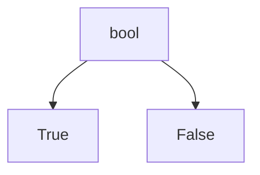
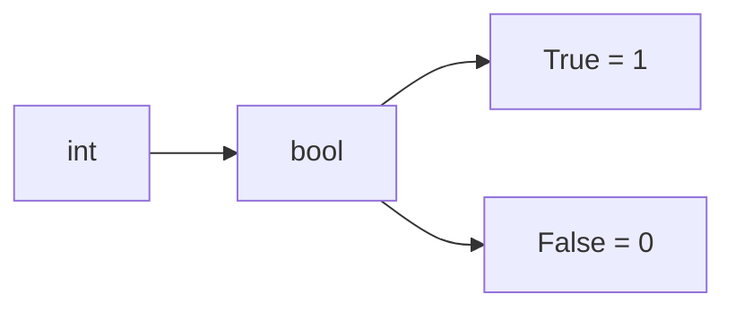

# bool Fundamentals

The `bool` type represents **Boolean values**, which model logical truth.

Python has exactly two Boolean values:

```python
True
False
````

These values are fundamental to:

* decision making
* control flow
* comparisons
* logical expressions



---

## 1. Boolean Values

A Boolean value answers a yes-or-no question.

Examples:

```python
is_raining = True
is_finished = False
```

A program often uses Boolean variables to represent conditions.

```python
if is_raining:
    print("Take an umbrella")
```

---

## 2. Type of Boolean Values

We can inspect the type using `type()`.

```python
print(type(True))
print(type(False))
```

Output:

```text
<class 'bool'>
<class 'bool'>
```

---

## 3. bool as a Subclass of int

In Python, `bool` is a subclass of `int`.

This means:

```python
print(True == 1)
print(False == 0)
```

Output:

```text
True
True
```

And arithmetic is possible:

```python
print(True + True)
print(True + False)
```

Output:

```text
2
1
```



This behavior is sometimes useful, but it can also be confusing if misunderstood.

---

## 4. Creating Boolean Values

Boolean values are often produced by comparisons.

```python
print(3 > 2)
print(10 == 5)
```

Output:

```text
True
False
```

They can also be created using `bool()`.

```python
print(bool(1))
print(bool(0))
```

Output:

```text
True
False
```

---

## 5. Booleans in Control Flow

Boolean values are central to control flow.

```python
logged_in = True

if logged_in:
    print("Welcome back")
else:
    print("Please log in")
```

The `if` statement depends on whether the condition is true or false.

---

## 6. Worked Examples

### Example 1: simple condition

```python
is_sunny = True

if is_sunny:
    print("Go outside")
```

Output:

```text
Go outside
```

### Example 2: equality result

```python
x = 5
y = 5

print(x == y)
```

Output:

```text
True
```

### Example 3: arithmetic with bool

```python
print(True + 3)
```

Output:

```text
4
```

---

## 7. Common Pitfalls

### Forgetting that `bool` is numeric

Because `True` and `False` behave like `1` and `0`, arithmetic expressions may produce surprising results.

### Using `== True` unnecessarily

Instead of:

```python
if is_ready == True:
    ...
```

prefer:

```python
if is_ready:
    ...
```

---

## 8. Summary

Key ideas:

* `bool` has exactly two values: `True` and `False`
* Boolean values represent logical truth
* `bool` is a subclass of `int`
* Booleans are produced by comparisons and used in control flow

The `bool` type is the foundation of logical reasoning in Python programs.