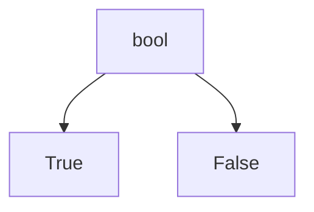
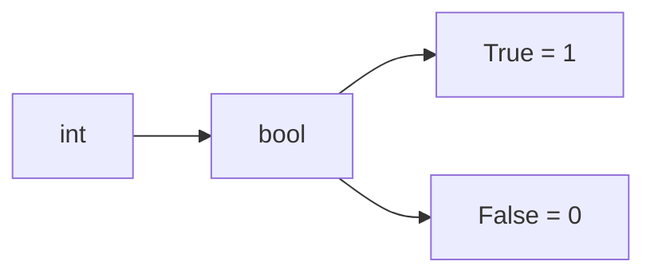

# bool Fundamentals

The `bool` type represents **Boolean values**, which model logical truth.

Python has exactly two Boolean values:

```python
True
False
````

These values are fundamental to:

* decision making
* control flow
* comparisons
* logical expressions



---

## 1. Boolean Values

A Boolean value answers a yes-or-no question.

Examples:

```python
is_raining = True
is_finished = False
```

A program often uses Boolean variables to represent conditions.

```python
if is_raining:
    print("Take an umbrella")
```

---

## 2. Type of Boolean Values

We can inspect the type using `type()`.

```python
print(type(True))
print(type(False))
```

Output:

```text
<class 'bool'>
<class 'bool'>
```

---

## 3. bool as a Subclass of int

In Python, `bool` is a subclass of `int`.

This means:

```python
print(True == 1)
print(False == 0)
```

Output:

```text
True
True
```

And arithmetic is possible:

```python
print(True + True)
print(True + False)
```

Output:

```text
2
1
```



This behavior is sometimes useful, but it can also be confusing if misunderstood.

---

## 4. Creating Boolean Values

Boolean values are often produced by comparisons.

```python
print(3 > 2)
print(10 == 5)
```

Output:

```text
True
False
```

They can also be created using `bool()`.

```python
print(bool(1))
print(bool(0))
```

Output:

```text
True
False
```

---

## 5. Booleans in Control Flow

Boolean values are central to control flow.

```python
logged_in = True

if logged_in:
    print("Welcome back")
else:
    print("Please log in")
```

The `if` statement depends on whether the condition is true or false.

---

## 6. Worked Examples

### Example 1: simple condition

```python
is_sunny = True

if is_sunny:
    print("Go outside")
```

Output:

```text
Go outside
```

### Example 2: equality result

```python
x = 5
y = 5

print(x == y)
```

Output:

```text
True
```

### Example 3: arithmetic with bool

```python
print(True + 3)
```

Output:

```text
4
```

---

## 7. Common Pitfalls

### Forgetting that `bool` is numeric

Because `True` and `False` behave like `1` and `0`, arithmetic expressions may produce surprising results.

### Using `== True` unnecessarily

Instead of:

```python
if is_ready == True:
    ...
```

prefer:

```python
if is_ready:
    ...
```

---


## 8. Summary

Key ideas:

* `bool` has exactly two values: `True` and `False`
* Boolean values represent logical truth
* `bool` is a subclass of `int`
* Booleans are produced by comparisons and used in control flow

The `bool` type is the foundation of logical reasoning in Python programs.


## Exercises

**Exercise 1.**
`bool` is a subclass of `int` in Python. Predict the output and explain why each expression works:

```python
print(True + True)
print(True * False)
print(isinstance(True, int))
print(True == 1)
print(True is 1)
```

Why did Python make `bool` a subclass of `int`? What practical benefit does this provide?

??? success "Solution to Exercise 1"
    Output:

    ```text
    2
    0
    True
    True
    False
    ```

    - `True + True` = `1 + 1` = `2`: `True` behaves as integer `1` in arithmetic.
    - `True * False` = `1 * 0` = `0`: `False` behaves as integer `0`.
    - `isinstance(True, int)` = `True`: `bool` inherits from `int`.
    - `True == 1` = `True`: equality holds because `bool` inherits `int`'s comparison.
    - `True is 1` = `False`: `True` and `1` are different objects (different types).

    Python made `bool` a subclass of `int` for practical reasons: it allows booleans to participate seamlessly in arithmetic. `sum(x > 0 for x in data)` counts positive values because each `True` contributes `1` to the sum. This would not work if `bool` were a completely separate type.

---

**Exercise 2.**
Explain the difference between `==` and `is` when comparing booleans:

```python
print(1 == True)
print(1 is True)
print(0 == False)
print(0 is False)
```

Even though `1 == True` is `True`, are `1` and `True` the same object? Why does this distinction matter?

??? success "Solution to Exercise 2"
    Output:

    ```text
    True
    False
    True
    False
    ```

    `1 == True` is `True` because `==` checks value equality, and `True` has integer value `1`. But `1 is True` is `False` because `is` checks identity -- `1` is an `int` object and `True` is a `bool` object. They are different objects with different types, even though they compare as equal.

    This matters in practice: if you use `is True` to check a return value, a function returning `1` (truthy but not `True`) would fail the check. `is True` should only be used when you need to verify that the value is specifically the boolean `True`, not just any truthy value.

---

**Exercise 3.**
A programmer writes `if x == True:` instead of `if x:`. Explain why the latter is preferred in most cases. Then give an example where `if x == True:` would behave differently from `if x:` and explain why.

??? success "Solution to Exercise 3"
    `if x:` checks the **truthiness** of `x`. Any truthy value (nonzero numbers, non-empty strings/containers, etc.) passes.

    `if x == True:` checks whether `x` is **equal to** `True`. This is subtly different:

    ```python
    x = 2
    if x:           # Passes: 2 is truthy
        print("truthy")
    if x == True:   # Fails: 2 == True is False (2 != 1)
        print("equals True")
    ```

    `2 == True` is `False` because `True` equals `1` (as an int), and `2 != 1`. But `2` is truthy because it is nonzero.

    `if x:` is preferred because it is idiomatic, concise, and correctly checks truthiness. `if x == True:` introduces a subtle bug for numeric values other than `0` and `1`. Use `if x == True:` only in the rare case where you specifically need to distinguish `True` from other truthy values.
