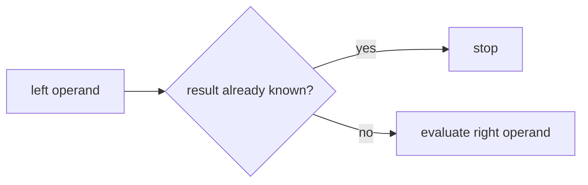

# bool Operators

Python provides logical operators for combining and transforming Boolean expressions.

The three Boolean operators are:

- `and`
- `or`
- `not`

These operators are essential for building compound conditions.

```mermaid
flowchart TD
    A[Boolean expressions]
    A --> B[and]
    A --> C[or]
    A --> D[not]
````

---

## 1. The `and` Operator

`and` returns `True` only if **both operands are true**.

```python
print(True and True)
print(True and False)
```

Output:

```text
True
False
```

Truth table:

| A     | B     | A and B |
| ----- | ----- | ------- |
| True  | True  | True    |
| True  | False | False   |
| False | True  | False   |
| False | False | False   |

Example:

```python
age = 20
has_id = True

if age >= 18 and has_id:
    print("Entry allowed")
```

---

## 2. The `or` Operator

`or` returns `True` if **at least one operand is true**.

```python
print(True or False)
print(False or False)
```

Output:

```text
True
False
```

Truth table:

| A     | B     | A or B |
| ----- | ----- | ------ |
| True  | True  | True   |
| True  | False | True   |
| False | True  | True   |
| False | False | False  |

Example:

```python
is_weekend = True
is_holiday = False

if is_weekend or is_holiday:
    print("No work today")
```

---

## 3. The `not` Operator

`not` reverses a Boolean value.

```python
print(not True)
print(not False)
```

Output:

```text
False
True
```

Truth table:

| A     | not A |
| ----- | ----- |
| True  | False |
| False | True  |

Example:

```python
logged_in = False

if not logged_in:
    print("Please sign in")
```

---

## 4. Short-Circuit Evaluation

Python’s Boolean operators use **short-circuit evaluation**.

This means evaluation stops as soon as the result is known.

### `and`

If the left side is false, Python does not need to evaluate the right side.

```python
False and print("hello")
```

The `print()` call is never executed.

### `or`

If the left side is true, Python does not need to evaluate the right side.

```python
True or print("hello")
```

Again, `print()` is not executed.



Short-circuiting is useful for guard conditions.

```python
x = None

if x is not None and x > 0:
    print("positive")
```

---

## 5. Operators Return Values

In Python, `and` and `or` return one of their operands, not necessarily `True` or `False`.

```python
print(0 or 5)
print("" or "default")
print(3 and 7)
```

Output:

```text
5
default
7
```

This behavior is often used for fallback values.

```python
name = user_input or "Guest"
```

---

## 6. Worked Examples

### Example 1: combined condition

```python
age = 25
has_ticket = True

print(age >= 18 and has_ticket)
```

### Example 2: fallback value

```python
username = ""
display_name = username or "Anonymous"

print(display_name)
```

Output:

```text
Anonymous
```

### Example 3: negation

```python
is_busy = False
print(not is_busy)
```

Output:

```text
True
```

---

## 7. Common Pitfalls

### Assuming `and` and `or` always return `bool`

They often return one of the original operands.

### Forgetting precedence

`not` has higher precedence than `and`, which has higher precedence than `or`.

Use parentheses when clarity matters.

---


## 8. Summary

Key ideas:

* `and` requires both conditions to be true
* `or` requires at least one condition to be true
* `not` reverses truth value
* Python uses short-circuit evaluation
* `and` and `or` may return operands, not just Booleans

Boolean operators let programs express complex logic clearly and efficiently.


## Exercises

**Exercise 1.**
Python's `and` and `or` return one of their operands, not necessarily `True` or `False`. Predict the output:

```python
print(0 and "hello")
print(1 and "hello")
print("" or "default")
print("value" or "default")
print(None and 42)
print([] or {} or "fallback")
```

State the exact rule: what does `and` return? What does `or` return? Why is `[] or {} or "fallback"` equal to `"fallback"` and not `{}`?

??? success "Solution to Exercise 1"
    Output:

    ```text
    0
    hello
    default
    value
    None
    fallback
    ```

    The rules:

    - `and` returns the **first falsy operand**, or the **last operand** if all are truthy. It stops at the first falsy value because once one operand is false, the whole `and` is false.
    - `or` returns the **first truthy operand**, or the **last operand** if all are falsy. It stops at the first truthy value because once one operand is true, the whole `or` is true.

    For `[] or {} or "fallback"`: `[]` is falsy, so `or` moves to `{}`. `{}` is also falsy, so `or` moves to `"fallback"`. `"fallback"` is truthy, so it is returned. `{}` is not returned because it is falsy -- `or` keeps searching for a truthy value.

---

**Exercise 2.**
Short-circuit evaluation means Python may not evaluate the right operand. Predict whether the function `boom()` is called in each case:

```python
def boom():
    raise ValueError("BOOM!")

result1 = False and boom()
result2 = True or boom()
result3 = True and boom()
result4 = False or boom()
```

Which of these four lines raises `ValueError`? Explain the short-circuit rule for each operator. Then show a practical example where short-circuiting prevents an error.

??? success "Solution to Exercise 2"
    - `result1 = False and boom()` -- `boom()` is **NOT called**. `and` short-circuits: `False` is falsy, so the result is already `False` without evaluating the right side.
    - `result2 = True or boom()` -- `boom()` is **NOT called**. `or` short-circuits: `True` is truthy, so the result is already `True`.
    - `result3 = True and boom()` -- `boom()` **IS called**, raises `ValueError`. `True` is truthy, so `and` must evaluate the right side.
    - `result4 = False or boom()` -- `boom()` **IS called**, raises `ValueError`. `False` is falsy, so `or` must evaluate the right side.

    Lines 3 and 4 raise `ValueError`.

    Practical example of short-circuiting preventing an error:

    ```python
    data = None
    if data is not None and len(data) > 0:
        process(data)
    ```

    If `data` is `None`, the `and` short-circuits after `data is not None` is `False`, and `len(data)` is never called. Without short-circuiting, `len(None)` would raise `TypeError`.

---

**Exercise 3.**
Operator precedence for boolean operators is: `not` > `and` > `or`. Predict the output without adding parentheses:

```python
print(True or False and False)
print(not True or True)
print(not False and not False)
print(True or True and False)
```

Then add explicit parentheses to each expression to show the actual evaluation order. Why does Python give `and` higher precedence than `or`?

??? success "Solution to Exercise 3"
    Output:

    ```text
    True
    True
    True
    True
    ```

    With explicit parentheses:

    - `True or (False and False)` = `True or False` = `True`
    - `(not True) or True` = `False or True` = `True`
    - `(not False) and (not False)` = `True and True` = `True`
    - `True or (True and False)` = `True or False` = `True`

    Python gives `and` higher precedence than `or` because this matches how logical expressions are naturally read and how they work in Boolean algebra. In everyday language, "A or B and C" usually means "A or (B and C)" -- the `and` binds more tightly, just as multiplication binds more tightly than addition in arithmetic. This parallel (`and` is like `*`, `or` is like `+`) is a deliberate design choice.
