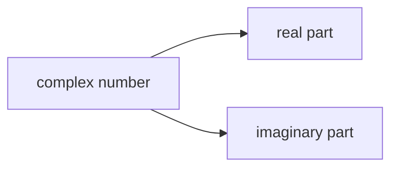
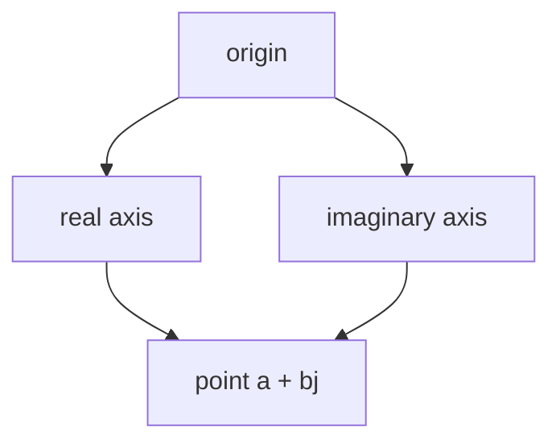

# complex Fundamentals

The `complex` type represents **complex numbers**, which include both a real part and an imaginary part.

A complex number has the form:

\[
a + bj
\]

where:

- \(a\) is the real part
- \(b\) is the imaginary part
- `j` is Python’s symbol for the imaginary unit

Examples:

```python
1 + 2j
3 - 4j
0 + 1j
````



---

## 1. Creating Complex Numbers

Complex numbers can be written directly.

```python
z = 2 + 3j
print(z)
```

Output:

```text
(2+3j)
```

They can also be created with `complex()`.

```python
z = complex(2, 3)
print(z)
```

Output:

```text
(2+3j)
```

---

## 2. Real and Imaginary Parts

Python complex numbers expose `.real` and `.imag` attributes.

```python
z = 4 + 5j

print(z.real)
print(z.imag)
```

Output:

```text
4.0
5.0
```

---

## 3. Complex Arithmetic

Complex numbers support arithmetic operations.

```python
a = 1 + 2j
b = 3 + 4j

print(a + b)
print(a - b)
print(a * b)
```

Output:

```text
(4+6j)
(-2-2j)
(-5+10j)
```

---

## 4. Conjugates

The conjugate of a complex number changes the sign of the imaginary part.

```python
z = 2 + 3j
print(z.conjugate())
```

Output:

```text
(2-3j)
```

Conjugates are useful in algebra and engineering.

---

## 5. Complex Numbers and Magnitude

The magnitude of a complex number behaves like its distance from the origin in the complex plane.

```python
z = 3 + 4j
print(abs(z))
```

Output:

```text
5.0
```

This follows the Pythagorean relationship:

[
|a + bj| = \sqrt{a^2 + b^2}
]



---

## 6. Equality and Comparison

Complex numbers support equality comparison:

```python
print((1 + 2j) == (1 + 2j))
```

But they do not support ordering comparisons such as `<` or `>`.

```python
# (1+2j) < (2+3j)   # TypeError
```

This is because complex numbers are not ordered like real numbers.

---

## 7. Worked Examples

### Example 1: addition

```python
z1 = 1 + 1j
z2 = 2 + 3j

print(z1 + z2)
```

Output:

```text
(3+4j)
```

### Example 2: magnitude

```python
z = 6 + 8j
print(abs(z))
```

Output:

```text
10.0
```

### Example 3: conjugate

```python
z = 5 - 2j
print(z.conjugate())
```

Output:

```text
(5+2j)
```

---

## 8. Common Uses

Complex numbers appear in:

* signal processing
* electrical engineering
* physics
* mathematics

They are less common in beginner Python programming, but Python includes them as a built-in numeric type.

---

## 9. Summary

Key ideas:

* `complex` represents numbers with real and imaginary parts
* complex numbers use `j` for the imaginary unit
* Python supports complex arithmetic directly
* `.real`, `.imag`, and `.conjugate()` expose useful properties
* `abs()` gives the magnitude

The `complex` type extends Python’s numeric model beyond ordinary real-number arithmetic.