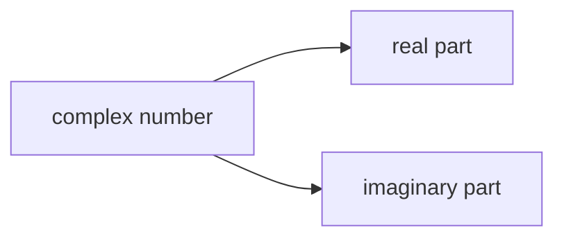
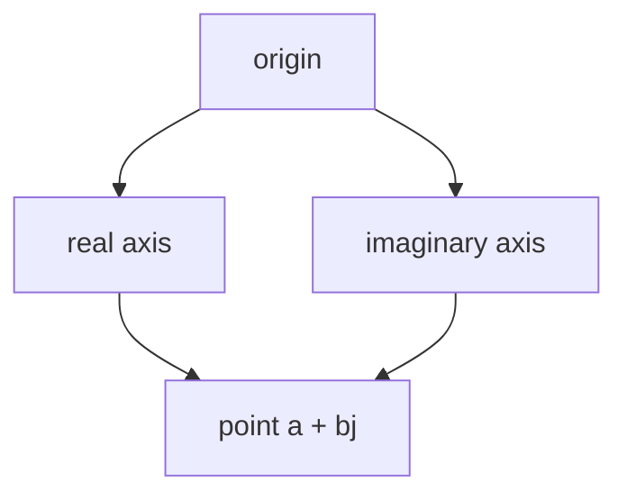

# complex Fundamentals

The `complex` type represents **complex numbers**, which include both a real part and an imaginary part.

A complex number has the form:

\[
a + bj
\]

where:

- \(a\) is the real part
- \(b\) is the imaginary part
- `j` is Python’s symbol for the imaginary unit

Examples:

```python
1 + 2j
3 - 4j
0 + 1j
````



---

## 1. Creating Complex Numbers

Complex numbers can be written directly.

```python
z = 2 + 3j
print(z)
```

Output:

```text
(2+3j)
```

They can also be created with `complex()`.

```python
z = complex(2, 3)
print(z)
```

Output:

```text
(2+3j)
```

---

## 2. Real and Imaginary Parts

Python complex numbers expose `.real` and `.imag` attributes.

```python
z = 4 + 5j

print(z.real)
print(z.imag)
```

Output:

```text
4.0
5.0
```

---

## 3. Complex Arithmetic

Complex numbers support arithmetic operations.

```python
a = 1 + 2j
b = 3 + 4j

print(a + b)
print(a - b)
print(a * b)
```

Output:

```text
(4+6j)
(-2-2j)
(-5+10j)
```

---

## 4. Conjugates

The conjugate of a complex number changes the sign of the imaginary part.

```python
z = 2 + 3j
print(z.conjugate())
```

Output:

```text
(2-3j)
```

Conjugates are useful in algebra and engineering.

---

## 5. Complex Numbers and Magnitude

The magnitude of a complex number behaves like its distance from the origin in the complex plane.

```python
z = 3 + 4j
print(abs(z))
```

Output:

```text
5.0
```

This follows the Pythagorean relationship:

[
|a + bj| = \sqrt{a^2 + b^2}
]



---

## 6. Equality and Comparison

Complex numbers support equality comparison:

```python
print((1 + 2j) == (1 + 2j))
```

But they do not support ordering comparisons such as `<` or `>`.

```python
# (1+2j) < (2+3j)   # TypeError
```

This is because complex numbers are not ordered like real numbers.

---

## 7. Worked Examples

### Example 1: addition

```python
z1 = 1 + 1j
z2 = 2 + 3j

print(z1 + z2)
```

Output:

```text
(3+4j)
```

### Example 2: magnitude

```python
z = 6 + 8j
print(abs(z))
```

Output:

```text
10.0
```

### Example 3: conjugate

```python
z = 5 - 2j
print(z.conjugate())
```

Output:

```text
(5+2j)
```

---

## 8. Common Uses

Complex numbers appear in:

* signal processing
* electrical engineering
* physics
* mathematics

They are less common in beginner Python programming, but Python includes them as a built-in numeric type.

---


## 9. Summary

Key ideas:

* `complex` represents numbers with real and imaginary parts
* complex numbers use `j` for the imaginary unit
* Python supports complex arithmetic directly
* `.real`, `.imag`, and `.conjugate()` expose useful properties
* `abs()` gives the magnitude

The `complex` type extends Python’s numeric model beyond ordinary real-number arithmetic.


## Exercises

**Exercise 1.**
Complex numbers do not support ordering comparisons (`<`, `>`). Explain why this restriction exists mathematically. Given that Python allows `3 == 3+0j` (equality), why does it forbid `3 < 3+1j` (ordering)? How does the complex plane differ from the real number line in this regard?

??? success "Solution to Exercise 1"
    The real numbers are **totally ordered**: for any two distinct real numbers, one is always greater than the other. This is because the real numbers form a one-dimensional line.

    Complex numbers exist on a **two-dimensional plane** (the complex plane), with a real axis and an imaginary axis. There is no natural way to order points on a plane. Is `1 + 2j` greater or less than `2 + 1j`? Neither answer is mathematically meaningful.

    Python allows `3 == 3+0j` because equality is well-defined in two dimensions -- two points are equal if and only if both their coordinates match. But `<` and `>` require a total ordering, which does not exist for complex numbers. Python raises `TypeError` for `<` and `>` to avoid imposing an arbitrary, mathematically meaningless ordering.

---

**Exercise 2.**
A programmer writes:

```python
z = 3 + 4j
print(type(z.real))
print(type(z.imag))
```

Predict the output. Why are `.real` and `.imag` floats and not integers, even when the complex number was created from integers? What does this tell you about how Python stores complex numbers internally?

??? success "Solution to Exercise 2"
    Output:

    ```text
    <class 'float'>
    <class 'float'>
    ```

    Even though we wrote `3 + 4j` using integers, `.real` and `.imag` are always `float`. This is because Python's `complex` type internally stores both parts as C `double` values (64-bit floating-point). When you write `3 + 4j`, the integers `3` and `4` are converted to floats during construction.

    This means complex arithmetic always uses floating-point, not exact integer arithmetic. `(1+0j).real` is `1.0` (a float), not `1` (an int). If you need exact arithmetic on the real or imaginary part, you must explicitly convert: `int(z.real)`.

---

**Exercise 3.**
Predict the output and explain each result:

```python
print(1 + 2j + 3)
print(type(1 + 2j + 3))
print((1 + 2j) * (1 - 2j))
print(abs(3 + 4j))
print(abs(3 - 4j))
```

Why does `(1 + 2j) * (1 - 2j)` produce a real result? Why do `3 + 4j` and `3 - 4j` have the same `abs()` value?

??? success "Solution to Exercise 3"
    Output:

    ```text
    (4+2j)
    <class 'complex'>
    (5+0j)
    5.0
    5.0
    ```

    `1 + 2j + 3`: Python promotes `3` to `3+0j`, then adds: `(1+2j) + (3+0j)` = `(4+2j)`. The result type is always `complex` when a complex number is involved.

    `(1 + 2j) * (1 - 2j)`: This is a product of **conjugate pairs**. Using the formula: `(a+bj)(a-bj) = a^2 + b^2`. So `1^2 + 2^2 = 5`. The result `(5+0j)` is still a `complex` object even though the imaginary part is zero.

    `abs(3+4j)` and `abs(3-4j)` both equal `5.0` because `abs()` computes the magnitude (distance from origin): `sqrt(3^2 + 4^2) = 5`. A complex number and its conjugate always have the same magnitude because they are the same distance from the origin (just reflected across the real axis).
