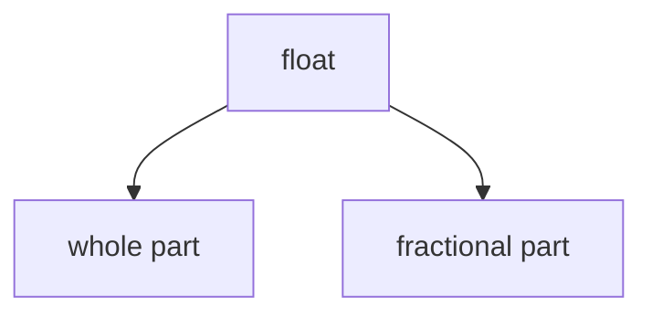
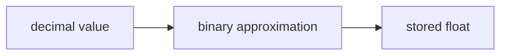

# float Fundamentals

The `float` type represents **floating-point numbers**, which are numbers with fractional parts.

Examples:

```python
3.14
0.5
-2.75
1.0
````

Floats are used to represent:

* measurements
* scientific values
* real-number approximations
* division results



---

## 1. Floating-Point Numbers

A floating-point number usually includes a decimal point.

```python
x = 3.14
y = -0.25
z = 2.0
```

Unlike integers, floats can represent values between whole numbers.

---

## 2. Float Arithmetic

Floats support the same main arithmetic operators as integers.

```python
a = 5.5
b = 2.0

print(a + b)
print(a - b)
print(a * b)
print(a / b)
```

Output:

```text
7.5
3.5
11.0
2.75
```

---

## 3. Division Produces Floats

In Python, the `/` operator returns a float even when the mathematical result is a whole number.

```python
print(6 / 2)
```

Output:

```text
3.0
```

This behavior distinguishes `/` from floor division `//`.

---

## 4. Scientific Notation

Python supports scientific notation for floats.

```python
a = 1.5e3
b = 2.0e-2

print(a)
print(b)
```

Output:

```text
1500.0
0.02
```

This notation is useful in science and engineering.

---

## 5. Floating-Point Approximation

Floats are **approximations**, not exact representations of most decimal fractions.

For example:

```python
print(0.1 + 0.2)
```

Output may be:

```text
0.30000000000000004
```

This happens because many decimal values cannot be represented exactly in binary floating-point form.



---

## 6. Comparing Floats Carefully

Because floats are approximate, direct equality comparisons can be misleading.

```python
print(0.1 + 0.2 == 0.3)
```

Output:

```text
False
```

A safer approach is to compare with tolerance.

```python
x = 0.1 + 0.2
print(abs(x - 0.3) < 1e-9)
```

Output:

```text
True
```

---

## 7. Converting to Float

The `float()` function converts compatible values to floats.

```python
print(float(5))
print(float("3.14"))
```

Output:

```text
5.0
3.14
```

---

## 8. Worked Examples

### Example 1: average

```python
total = 7
count = 2
average = total / count

print(average)
```

Output:

```text
3.5
```

### Example 2: measurement

```python
length = 2.5
width = 4.0
area = length * width

print(area)
```

Output:

```text
10.0
```

### Example 3: approximation issue

```python
x = 0.1 + 0.2
print(x)
```

---

## 9. Common Pitfalls

### Expecting exact decimal behavior

Floats are not ideal when exact decimal arithmetic is required, such as in financial calculations.

### Comparing with `==`

Direct equality is often unsafe for computed float values.

---


## 10. Summary

Key ideas:

* `float` represents numbers with fractional parts
* floats support ordinary arithmetic
* division with `/` produces floats
* floating-point values are approximations
* float comparisons often require tolerance

The `float` type is essential for measurements, ratios, and scientific computation.


## Exercises

**Exercise 1.**
Explain why `0.1 + 0.2 == 0.3` is `False` in Python. What is happening at the binary representation level? If a programmer needs exact decimal arithmetic (e.g., for financial calculations), what should they use instead of `float`?

??? success "Solution to Exercise 1"
    `0.1` cannot be represented exactly in binary floating-point. Its binary expansion is `0.0001100110011...` (repeating infinitely). The stored value is slightly more than `0.1`. Similarly, `0.2` is slightly more than `0.2`. When added, the rounding errors accumulate, producing `0.30000000000000004`, which is not equal to the stored value of `0.3` (which is slightly less than the mathematical 0.3).

    For exact decimal arithmetic, use `decimal.Decimal`:

    ```python
    from decimal import Decimal
    print(Decimal('0.1') + Decimal('0.2') == Decimal('0.3'))  # True
    ```

    `Decimal` stores numbers in base 10, so `0.1` is exact. The `fractions.Fraction` module is another option for exact rational arithmetic.

---

**Exercise 2.**
Predict the output of each line:

```python
print(1 / 3)
print(type(1 / 3))
print(4 / 2)
print(type(4 / 2))
```

Why does `4 / 2` return `2.0` (a float) instead of `2` (an int), even though the result is a whole number? What design principle does this reflect?

??? success "Solution to Exercise 2"
    Output:

    ```text
    0.3333333333333333
    <class 'float'>
    2.0
    <class 'float'>
    ```

    The `/` operator in Python 3 **always** returns a `float`, even when both operands are integers and the result is a whole number. This is a deliberate design decision: the return type of `/` is determined by the **operator**, not by the **values**. This makes the behavior **predictable** -- you always know `a / b` produces a `float`, regardless of the specific values of `a` and `b`.

    If you want integer division, use `//`. This predictability principle (the type of the result depends on the operation, not on the data) prevents subtle bugs where code works for some inputs but fails for others.

---

**Exercise 3.**
A student writes `if total == 3.0:` after computing `total = 0.1 + 0.1 + ... + 0.1` (30 times). The condition is `False` even though the intended sum is 3.0. Explain why, and show two correct ways to check if a float is "approximately equal" to an expected value.

??? success "Solution to Exercise 3"
    Each addition of `0.1` accumulates a small rounding error. After 30 additions, the total is approximately `2.9999999999999996` or `3.0000000000000004` (the exact value depends on the order of operations and rounding). This is not exactly `3.0`, so `==` returns `False`.

    **Correct approach 1 -- absolute tolerance:**

    ```python
    import math
    if math.isclose(total, 3.0):
        print("approximately equal")
    ```

    `math.isclose` uses both relative and absolute tolerance by default.

    **Correct approach 2 -- explicit tolerance:**

    ```python
    if abs(total - 3.0) < 1e-9:
        print("approximately equal")
    ```

    The general rule: **never use `==` to compare computed floating-point values**. Always use a tolerance-based comparison. The appropriate tolerance depends on the computation and the required precision.
