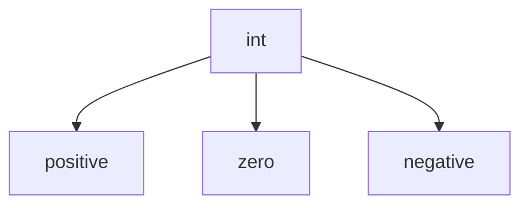

# int Fundamentals

The `int` type represents **integers**, or whole numbers without fractional parts.

Examples of integers include:

```python
0
1
-5
42
1000000
````

Integers are one of the most fundamental data types in Python. They are used for:

* counting
* indexing
* loop control
* exact arithmetic
* representing discrete quantities



---

## 1. Integers as Mathematical Objects

An integer represents a whole number on the number line.


Unlike floating-point numbers, integers have **no decimal point**.

```python
a = 5
b = -12
c = 0
```

---

## 2. Integer Arithmetic

Python supports the standard arithmetic operations on integers.

| Operation      | Symbol | Example  | Result |
| -------------- | ------ | -------- | ------ |
| addition       | `+`    | `3 + 2`  | `5`    |
| subtraction    | `-`    | `3 - 2`  | `1`    |
| multiplication | `*`    | `3 * 2`  | `6`    |
| division       | `/`    | `3 / 2`  | `1.5`  |
| floor division | `//`   | `3 // 2` | `1`    |
| remainder      | `%`    | `3 % 2`  | `1`    |
| exponentiation | `**`   | `3 ** 2` | `9`    |

Example:

```python
a = 7
b = 3

print(a + b)
print(a - b)
print(a * b)
print(a // b)
print(a % b)
print(a ** b)
```

---

## 3. Exactness of Integers

Python integers are **exact**.

For example:

```python
print(10 + 20)
print(2 * 100)
```

These results are represented precisely.

This differs from floating-point numbers, which may introduce rounding error.

---

## 4. Arbitrary Precision

Unlike many programming languages, Python integers are **arbitrary precision**.

That means Python integers can grow as large as memory allows.

```python
x = 10 ** 50
print(x)
```

Output:

```text
100000000000000000000000000000000000000000000000000
```

This is an important distinction from languages that restrict integers to fixed sizes such as 32-bit or 64-bit storage.


---

## 5. Integer Literals

Python supports several integer literal formats.

| Base        | Example  | Meaning |
| ----------- | -------- | ------- |
| decimal     | `42`     | base 10 |
| binary      | `0b1010` | base 2  |
| octal       | `0o52`   | base 8  |
| hexadecimal | `0x2A`   | base 16 |

Example:

```python
print(42)
print(0b101010)
print(0o52)
print(0x2A)
```

All of these represent the same value.

---

## 6. Underscores in Integer Literals

Python allows underscores in numeric literals to improve readability.

```python
population = 1_000_000
seconds = 86_400
```

These underscores do not affect the value.

```python
print(population)
print(seconds)
```

---

## 7. Integers in Boolean Contexts

Integers can appear in conditions.

* `0` behaves as `False`
* nonzero integers behave as `True`

Example:

```python
if 0:
    print("This will not print")

if 5:
    print("This will print")
```

---

## 8. Worked Examples

### Example 1: counting items

```python
apples = 5
oranges = 3
total = apples + oranges

print(total)
```

Output:

```text
8
```

### Example 2: even or odd

```python
n = 17

if n % 2 == 0:
    print("even")
else:
    print("odd")
```

Output:

```text
odd
```

### Example 3: power computation

```python
print(2 ** 10)
```

Output:

```text
1024
```

---

## 9. Common Pitfalls

### Using `/` when you want an integer result

```python
print(7 / 2)
```

This produces:

```text
3.5
```

Use `//` for floor division if an integer-style quotient is intended.

### Confusing `%` with percentage

The `%` operator computes the **remainder**, not a percentage.

---


## 10. Summary

Key ideas:

* `int` represents whole numbers
* integers support exact arithmetic
* Python integers have arbitrary precision
* integer literals can be written in multiple bases
* `0` is falsy and nonzero integers are truthy

The `int` type is the foundation for counting, indexing, and exact numeric computation.


## Exercises

**Exercise 1.**
Python integers have arbitrary precision, meaning `2 ** 1000` works without overflow. But this has a cost. Explain what trade-off Python makes compared to languages like C where integers are fixed-width (e.g., 32-bit or 64-bit). Consider memory usage, arithmetic speed, and what happens when a computation exceeds the range.

??? success "Solution to Exercise 1"
    Python integers use arbitrary precision by storing numbers as variable-length arrays of digits (internally, base $2^{30}$ chunks). The trade-offs:

    - **Memory**: A Python `int` storing `42` uses ~28 bytes (object header, reference count, type pointer, digit array). A C `int32` uses only 4 bytes. For large datasets, this 7x overhead is significant.
    - **Speed**: Each arithmetic operation on Python integers involves function calls, memory allocation, and multi-word arithmetic for large numbers. A C integer addition is a single CPU instruction. Python integers are ~10-100x slower for arithmetic.
    - **Overflow**: C integers silently wrap around on overflow (e.g., `INT_MAX + 1` becomes `INT_MIN`). Python integers grow to accommodate any value, so `2 ** 1000` works correctly. C would need special "big integer" libraries.

    The trade-off is correctness vs. performance. Python prioritizes correctness (never losing data to overflow) at the cost of speed and memory. For performance-critical code, libraries like NumPy use fixed-width integers.

---

**Exercise 2.**
Predict the output and explain *why* each division operator behaves differently:

```python
print(7 / 2)
print(7 // 2)
print(-7 // 2)
print(type(7 / 2))
print(type(7 // 2))
```

Why does `-7 // 2` produce `-4` instead of `-3`? What does "floor division" mean mathematically, and why is this behavior useful?

??? success "Solution to Exercise 2"
    Output:

    ```text
    3.5
    3
    -4
    <class 'float'>
    <class 'int'>
    ```

    - `7 / 2` is **true division**: always returns a `float`, even when the result is a whole number.
    - `7 // 2` is **floor division**: returns the largest integer less than or equal to the exact result. $\lfloor 7/2 \rfloor = \lfloor 3.5 \rfloor = 3$.
    - `-7 // 2`: The exact result is $-3.5$. The floor (largest integer $\leq -3.5$) is $-4$, not $-3$. This is "floor toward negative infinity," not "truncation toward zero."

    Floor division is useful because it pairs with the modulo operator (`%`) to satisfy the invariant: `a == (a // b) * b + (a % b)` for all integers. This makes `//` and `%` consistent and useful for cyclic computations (clock arithmetic, array wrapping, etc.).

---

**Exercise 3.**
In Python, `bool` is a subclass of `int`, with `True == 1` and `False == 0`. Predict the output:

```python
print(True + True + True)
print(True * 10)
print(sum([True, False, True, True]))
```

Why did Python's designers make `bool` a subclass of `int` rather than a completely separate type? What practical benefit does this provide?

??? success "Solution to Exercise 3"
    Output:

    ```text
    3
    10
    3
    ```

    `True` behaves as `1` and `False` as `0` in arithmetic contexts because `bool` inherits from `int`. So `True + True + True = 1 + 1 + 1 = 3`, `True * 10 = 1 * 10 = 10`, and `sum([True, False, True, True]) = 1 + 0 + 1 + 1 = 3`.

    Making `bool` a subclass of `int` was a pragmatic design decision. It allows booleans to work seamlessly in numeric contexts, which is extremely useful. For example, `sum(x > threshold for x in data)` counts how many values exceed a threshold -- each comparison produces `True` (1) or `False` (0), and `sum` adds them. Without this inheritance, you would need explicit conversions everywhere.
