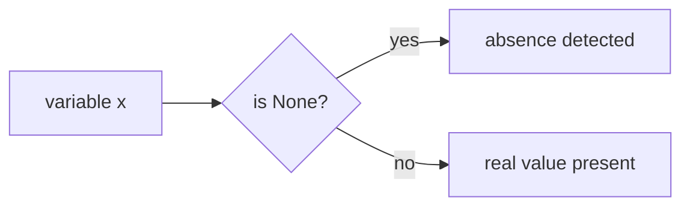

# None Type

Python includes a special singleton object called `None`.

`None` represents the **absence of a value**.

It is commonly used to indicate:

- missing data
- no result
- not yet initialized
- intentional emptiness

```mermaid
flowchart TD
    A[None]
    A --> B[absence of value]
    A --> C[single special object]
````

---

## 1. What is `None`?

`None` is not the same as:

* `0`
* `False`
* `""`
* `[]`

It is its own distinct object and type.

```python
print(type(None))
```

Output:

```text
<class 'NoneType'>
```

There is only one `None` object in a Python program.

---

## 2. Assigning `None`

A variable can be assigned `None` as a placeholder.

```python
result = None
print(result)
```

Output:

```text
None
```

This is useful when a value is not yet available.

---

## 3. Functions that Return `None`

A function that does not explicitly return a value returns `None`.

```python
def greet():
    print("Hello")

x = greet()
print(x)
```

Output:

```text
Hello
None
```

This is an important part of Python’s function model.

---

## 4. None in Boolean Contexts

`None` is falsy.

```python
print(bool(None))
```

Output:

```text
False
```

This means it behaves like false in conditions.

```python
value = None

if value:
    print("Has value")
else:
    print("No value")
```

Output:

```text
No value
```

---

## 5. Comparing with `None`

The recommended way to test for `None` is with `is`.

```python
x = None

if x is None:
    print("No value")
```

Why `is`?

Because `None` is a singleton object, and identity is the appropriate test.

Use:

```python
x is None
x is not None
```

instead of:

```python
x == None
```



---

## 6. Common Uses of `None`

### Default initialization

```python
best_score = None
```

### Missing result

```python
def find_item(items, target):
    for item in items:
        if item == target:
            return item
    return None
```

### Optional arguments

```python
def greet(name=None):
    if name is None:
        print("Hello, guest")
    else:
        print("Hello,", name)
```

---

## 7. Worked Examples

### Example 1: placeholder value

```python
data = None

if data is None:
    print("Not loaded yet")
```

### Example 2: function return

```python
def f():
    pass

print(f())
```

Output:

```text
None
```

### Example 3: optional argument

```python
def power(base, exponent=None):
    if exponent is None:
        return base * base
    return base ** exponent

print(power(3))
print(power(3, 3))
```

Output:

```text
9
27
```

---

## 8. Common Pitfalls

### Confusing `None` with `False`

`None` is falsy, but it is not the same value as `False`.

### Using `== None`

Prefer `is None` for clarity and correctness.

### Assuming `print()` returns a string

`print()` returns `None`; it only produces output as a side effect.

---

## 9. Summary

Key ideas:

* `None` represents the absence of a value
* its type is `NoneType`
* `None` is a singleton object
* `None` is falsy
* comparisons with `None` should use `is` and `is not`

The `None` object is an essential part of Python’s way of representing missing or intentionally absent values.