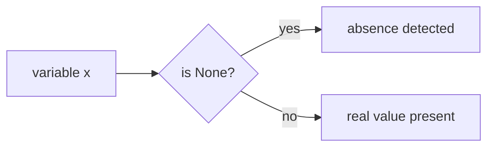

# None Type

Python includes a special singleton object called `None`.

`None` represents the **absence of a value**.

It is commonly used to indicate:

- missing data
- no result
- not yet initialized
- intentional emptiness

```mermaid
flowchart TD
    A[None]
    A --> B[absence of value]
    A --> C[single special object]
````

---

## 1. What is `None`?

`None` is not the same as:

* `0`
* `False`
* `""`
* `[]`

It is its own distinct object and type.

```python
print(type(None))
```

Output:

```text
<class 'NoneType'>
```

There is only one `None` object in a Python program.

---

## 2. Assigning `None`

A variable can be assigned `None` as a placeholder.

```python
result = None
print(result)
```

Output:

```text
None
```

This is useful when a value is not yet available.

---

## 3. Functions that Return `None`

A function that does not explicitly return a value returns `None`.

```python
def greet():
    print("Hello")

x = greet()
print(x)
```

Output:

```text
Hello
None
```

This is an important part of Python’s function model.

---

## 4. None in Boolean Contexts

`None` is falsy.

```python
print(bool(None))
```

Output:

```text
False
```

This means it behaves like false in conditions.

```python
value = None

if value:
    print("Has value")
else:
    print("No value")
```

Output:

```text
No value
```

---

## 5. Comparing with `None`

The recommended way to test for `None` is with `is`.

```python
x = None

if x is None:
    print("No value")
```

Why `is`?

Because `None` is a singleton object, and identity is the appropriate test.

Use:

```python
x is None
x is not None
```

instead of:

```python
x == None
```



---

## 6. Common Uses of `None`

### Default initialization

```python
best_score = None
```

### Missing result

```python
def find_item(items, target):
    for item in items:
        if item == target:
            return item
    return None
```

### Optional arguments

```python
def greet(name=None):
    if name is None:
        print("Hello, guest")
    else:
        print("Hello,", name)
```

---

## 7. Worked Examples

### Example 1: placeholder value

```python
data = None

if data is None:
    print("Not loaded yet")
```

### Example 2: function return

```python
def f():
    pass

print(f())
```

Output:

```text
None
```

### Example 3: optional argument

```python
def power(base, exponent=None):
    if exponent is None:
        return base * base
    return base ** exponent

print(power(3))
print(power(3, 3))
```

Output:

```text
9
27
```

---

## 8. Common Pitfalls

### Confusing `None` with `False`

`None` is falsy, but it is not the same value as `False`.

### Using `== None`

Prefer `is None` for clarity and correctness.

### Assuming `print()` returns a string

`print()` returns `None`; it only produces output as a side effect.

---


## 9. Summary

Key ideas:

* `None` represents the absence of a value
* its type is `NoneType`
* `None` is a singleton object
* `None` is falsy
* comparisons with `None` should use `is` and `is not`

The `None` object is an essential part of Python’s way of representing missing or intentionally absent values.


## Exercises

**Exercise 1.**
Python convention says to check for `None` using `is None` rather than `== None`. Explain *why* `is` is preferred. What could go wrong if a class defines a custom `__eq__` method? Give an example where `x == None` returns `True` but `x is None` returns `False`.

??? success "Solution to Exercise 1"
    `is` checks **identity** (same object in memory), while `==` checks **equality** (which calls the `__eq__` method). Since `None` is a singleton, `x is None` directly checks whether `x` is the one-and-only `None` object -- fast and unambiguous.

    `x == None` calls `x.__eq__(None)`, which can be overridden by any class:

    ```python
    class Sneaky:
        def __eq__(self, other):
            return True  # Claims to be equal to everything

    x = Sneaky()
    print(x == None)   # True -- but x is not None!
    print(x is None)   # False -- correct
    ```

    With `==`, a malicious or buggy `__eq__` can make any object "appear" to be `None`. With `is`, the check is purely an identity comparison that cannot be overridden. This is why PEP 8 mandates `is None` and `is not None`.

---

**Exercise 2.**
Every Python function that does not explicitly `return` a value returns `None`. Predict the output:

```python
def greet(name):
    print(f"Hello, {name}!")

result = greet("Alice")
print(result)
print(type(result))
```

Why does Python use `None` as the implicit return value rather than, say, raising an error? What does this tell you about the difference between "returning a value" and "producing a side effect"?

??? success "Solution to Exercise 2"
    Output:

    ```text
    Hello, Alice!
    None
    <class ‘NoneType’>
    ```

    `greet("Alice")` calls `print()`, which displays `Hello, Alice!` as a side effect. But `greet` has no `return` statement, so it implicitly returns `None`. `result` is bound to `None`.

    Python uses `None` (rather than raising an error) because many functions are called for their **side effects** (printing, writing files, modifying data structures) rather than their return value. Requiring an explicit `return` for every function would be verbose and annoying. The implicit `None` return signals "this function did its job but has no meaningful value to give back."

    The distinction: `print()` **produces a side effect** (text on screen) but **returns** `None`. A function like `len()` **returns a value** (the length) with no side effect. Confusing the two (e.g., writing `x = print("hello")` expecting `x` to be `"hello"`) is a common beginner mistake.

---

**Exercise 3.**
`None` is a singleton -- there is exactly one `None` object in the entire Python runtime. Explain what "singleton" means and how you can verify this:

```python
a = None
b = None
print(a is b)
```

Why is it safe to use `is` for `None` but not for integers like `257`? What fundamental difference between `None` and `257` guarantees this?

??? success "Solution to Exercise 3"
    A "singleton" means there is exactly **one instance** of that type in the entire Python process. Every variable assigned `None` refers to the same object:

    ```python
    a = None
    b = None
    print(a is b)  # True -- same object
    print(id(a) == id(b))  # True -- same memory address
    ```

    `is` is safe for `None` because the language **guarantees** that `None` is a singleton. There is no way to create a second `NoneType` instance. This guarantee is built into the language specification, not just an implementation detail.

    For integers like `257`, there is **no singleton guarantee**. The language does not promise that `a = 257; b = 257` will produce the same object. CPython interns small integers (-5 to 256) as an optimization, but this is an implementation detail. `257` might be interned in some contexts and not in others, so `a is b` gives unpredictable results. Only objects with a **language-level singleton guarantee** (`None`, `True`, `False`) should be compared with `is`.
