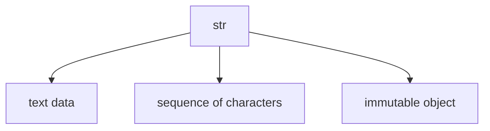
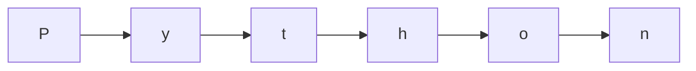

# str Fundamentals

The `str` type represents **text** in Python.

A string is a sequence of Unicode characters. Strings are used for:

- words and sentences
- names and labels
- file paths
- source code text
- user input
- formatted output

Examples:

```python
"hello"
"Python"
"123"
""
````



---

## 1. Strings as Sequences

A string is not just a block of text. It is an ordered sequence of characters.

```python
word = "Python"
```

This string contains six characters:



Because strings are sequences, they support indexing, slicing, iteration, and membership testing.

---

## 2. Strings Are Immutable

Strings are **immutable**, which means their contents cannot be changed in place.

Example:

```python
name = "Alice"
```

You cannot replace one character directly:

```python
# name[0] = "M"   # TypeError
```

Instead, string operations create new strings.

```python
new_name = "M" + name[1:]
print(new_name)
```

Output:

```text
Mlice
```

---

## 3. Unicode Text

Python strings use Unicode, which allows them to represent text from many languages and symbol systems.

```python
print("café")
print("你好")
print("😊")
```

This is one reason Python strings are more expressive than simple ASCII-only text models.

---

## 4. String Length

The number of characters in a string can be measured with `len()`.

```python
text = "Python"
print(len(text))
```

Output:

```text
6
```

---

## 5. Empty Strings

An empty string contains no characters.

```python
empty = ""
print(len(empty))
```

Output:

```text
0
```

Empty strings are falsy in Boolean contexts.

```python
if empty:
    print("non-empty")
else:
    print("empty")
```

---

## 6. Worked Examples

### Example 1: basic string

```python
language = "Python"
print(language)
```

### Example 2: length

```python
word = "code"
print(len(word))
```

Output:

```text
4
```

### Example 3: immutability idea

```python
s = "cat"
t = "b" + s[1:]
print(t)
```

Output:

```text
bat
```

---


## 7. Summary

Key ideas:

* `str` represents text
* strings are ordered sequences of Unicode characters
* strings are immutable
* strings can be empty or non-empty
* sequence operations are central to working with text

The `str` type is one of the most important and frequently used types in Python.


## Exercises

**Exercise 1.**
Strings are immutable. Explain what this means and predict the output:

```python
s = "hello"
s.upper()
print(s)
```

Why does `s` still contain `"hello"` after calling `.upper()`? What does `.upper()` return? How does immutability affect the way you work with strings compared to lists?

??? success "Solution to Exercise 1"
    Output: `hello`

    `s.upper()` does NOT modify `s`. Because strings are immutable, `.upper()` creates and **returns** a new string `"HELLO"`. The original string `s` is unchanged. The return value is discarded because it was not assigned to anything.

    To get the uppercase version: `s = s.upper()` (rebinds `s` to the new string).

    With mutable types like lists, `lst.sort()` modifies the list in place and returns `None`. With immutable strings, every "modification" method returns a new string. This is a fundamental difference: list methods often mutate in place; string methods always return new objects.

---

**Exercise 2.**
Python strings are sequences of Unicode code points, not bytes. Explain why `len("cafe\u0301")` returns `5`, not `4`, even though it displays as the 4-character word "cafe" with an accent. What is the difference between a "character" as a human perceives it and a "code point" as Python counts it?

??? success "Solution to Exercise 2"
    `"cafe\u0301"` contains 5 Unicode code points: `c`, `a`, `f`, `e`, and `\u0301` (a combining acute accent). Python's `len()` counts **code points**, not visual characters. The combining accent `\u0301` attaches to the preceding `e` to display as "e" but it is still a separate code point.

    A "character" as humans perceive it (a **grapheme cluster**) may consist of multiple code points. The accented "e" is one grapheme cluster but two code points (`e` + combining accent).

    To get the number of perceived characters, you would need to normalize the string (`unicodedata.normalize("NFC", s)` converts `e` + combining accent into the single code point `e`, making `len()` return `4`) or use a library that counts grapheme clusters.

    This is why text processing is harder than it seems -- "length" can mean different things depending on whether you count bytes, code points, or grapheme clusters.

---

**Exercise 3.**
A programmer writes:

```python
s = "hello"
s[0] = "H"
```

This raises `TypeError`. Explain why, and show the correct way to create a new string with the first character capitalized. Why did Python's designers make strings immutable rather than mutable?

??? success "Solution to Exercise 3"
    `s[0] = "H"` fails because strings do not support item assignment -- they are immutable.

    Correct approaches:

    ```python
    s = "H" + s[1:]        # Slice and concatenate
    s = s.capitalize()     # Built-in method (capitalizes first, lowercases rest)
    s = "H" + s[1:]        # Most explicit
    ```

    Python made strings immutable for several reasons:

    1. **Hashability**: Immutable strings can be used as dictionary keys and set elements. If strings were mutable, their hash could change after being used as a key, corrupting the dictionary.
    2. **Safety**: Strings can be freely shared between variables, functions, and data structures without risk of accidental modification. No defensive copying needed.
    3. **Optimization**: Python can intern (cache and share) identical strings, saving memory. This is only safe because strings cannot be changed after creation.
    4. **Thread safety**: Immutable strings can be safely shared between threads without locks.
