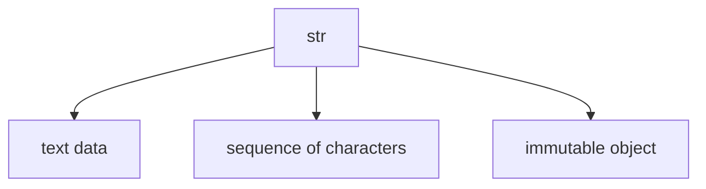
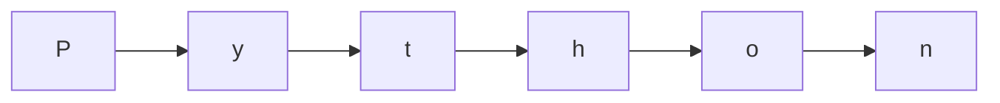

# str Fundamentals

The `str` type represents **text** in Python.

A string is a sequence of Unicode characters. Strings are used for:

- words and sentences
- names and labels
- file paths
- source code text
- user input
- formatted output

Examples:

```python
"hello"
"Python"
"123"
""
````



---

## 1. Strings as Sequences

A string is not just a block of text. It is an ordered sequence of characters.

```python
word = "Python"
```

This string contains six characters:



Because strings are sequences, they support indexing, slicing, iteration, and membership testing.

---

## 2. Strings Are Immutable

Strings are **immutable**, which means their contents cannot be changed in place.

Example:

```python
name = "Alice"
```

You cannot replace one character directly:

```python
# name[0] = "M"   # TypeError
```

Instead, string operations create new strings.

```python
new_name = "M" + name[1:]
print(new_name)
```

Output:

```text
Mlice
```

---

## 3. Unicode Text

Python strings use Unicode, which allows them to represent text from many languages and symbol systems.

```python
print("café")
print("你好")
print("😊")
```

This is one reason Python strings are more expressive than simple ASCII-only text models.

---

## 4. String Length

The number of characters in a string can be measured with `len()`.

```python
text = "Python"
print(len(text))
```

Output:

```text
6
```

---

## 5. Empty Strings

An empty string contains no characters.

```python
empty = ""
print(len(empty))
```

Output:

```text
0
```

Empty strings are falsy in Boolean contexts.

```python
if empty:
    print("non-empty")
else:
    print("empty")
```

---

## 6. Worked Examples

### Example 1: basic string

```python
language = "Python"
print(language)
```

### Example 2: length

```python
word = "code"
print(len(word))
```

Output:

```text
4
```

### Example 3: immutability idea

```python
s = "cat"
t = "b" + s[1:]
print(t)
```

Output:

```text
bat
```

---

## 7. Summary

Key ideas:

* `str` represents text
* strings are ordered sequences of Unicode characters
* strings are immutable
* strings can be empty or non-empty
* sequence operations are central to working with text

The `str` type is one of the most important and frequently used types in Python.