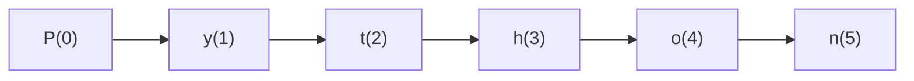

# str Indexing and Slicing

Because strings are sequences, individual characters and subsequences can be extracted.

This section covers:

- indexing
- negative indexing
- slicing
- step values

```mermaid
flowchart TD
    A[String sequence]
    A --> B[Indexing]
    A --> C[Slicing]
````

---

## 1. Indexing

Indexing retrieves a single character from a string.

```python
text = "Python"
print(text[0])
print(text[1])
```

Output:

```text
P
y
```

Index positions start at `0`.



---

## 2. Negative Indexing

Negative indexes count from the end.

```python
text = "Python"
print(text[-1])
print(text[-2])
```

Output:

```text
n
o
```

This is often convenient for suffix operations.

---

## 3. Slicing

Slicing extracts a substring.

```python
text = "Python"
print(text[0:2])
print(text[2:5])
```

Output:

```text
Py
tho
```

General form:

```python
text[start:stop]
```

The `stop` index is excluded.

---

## 4. Omitting Bounds

If `start` is omitted, slicing begins at the start.

If `stop` is omitted, slicing continues to the end.

```python
text = "Python"
print(text[:3])
print(text[3:])
```

Output:

```text
Pyt
hon
```

---

## 5. Step Values

Slicing can also include a step.

```python
text = "Python"
print(text[::2])
```

Output:

```text
Pto
```

General form:

```python
text[start:stop:step]
```

A negative step reverses direction.

```python
print(text[::-1])
```

Output:

```text
nohtyP
```

---

## 6. Strings Remain Immutable

Indexing and slicing do not modify the original string.

They return new strings.

```python
text = "Python"
part = text[:3]

print(text)
print(part)
```

---

## 7. Worked Examples

### Example 1: first character

```python
word = "banana"
print(word[0])
```

### Example 2: last character

```python
print(word[-1])
```

### Example 3: reverse string

```python
print(word[::-1])
```

Output:

```text
ananab
```

---

## 8. Common Pitfalls

### Off-by-one slicing

Remember that the stop index is excluded.

### Index out of range

```python
# text[100]   # IndexError
```

Slicing is more forgiving than indexing.

---

## 9. Summary

Key ideas:

* indexing retrieves one character
* negative indexing counts from the end
* slicing extracts substrings
* step values allow skipping and reversing
* all results are new strings

Indexing and slicing are essential for analyzing and transforming text.