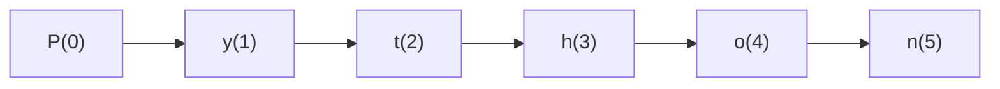

# str Indexing and Slicing

Because strings are sequences, individual characters and subsequences can be extracted.

This section covers:

- indexing
- negative indexing
- slicing
- step values

```mermaid
flowchart TD
    A[String sequence]
    A --> B[Indexing]
    A --> C[Slicing]
````

---

## 1. Indexing

Indexing retrieves a single character from a string.

```python
text = "Python"
print(text[0])
print(text[1])
```

Output:

```text
P
y
```

Index positions start at `0`.



---

## 2. Negative Indexing

Negative indexes count from the end.

```python
text = "Python"
print(text[-1])
print(text[-2])
```

Output:

```text
n
o
```

This is often convenient for suffix operations.

---

## 3. Slicing

Slicing extracts a substring.

```python
text = "Python"
print(text[0:2])
print(text[2:5])
```

Output:

```text
Py
tho
```

General form:

```python
text[start:stop]
```

The `stop` index is excluded.

---

## 4. Omitting Bounds

If `start` is omitted, slicing begins at the start.

If `stop` is omitted, slicing continues to the end.

```python
text = "Python"
print(text[:3])
print(text[3:])
```

Output:

```text
Pyt
hon
```

---

## 5. Step Values

Slicing can also include a step.

```python
text = "Python"
print(text[::2])
```

Output:

```text
Pto
```

General form:

```python
text[start:stop:step]
```

A negative step reverses direction.

```python
print(text[::-1])
```

Output:

```text
nohtyP
```

---

## 6. Strings Remain Immutable

Indexing and slicing do not modify the original string.

They return new strings.

```python
text = "Python"
part = text[:3]

print(text)
print(part)
```

---

## 7. Worked Examples

### Example 1: first character

```python
word = "banana"
print(word[0])
```

### Example 2: last character

```python
print(word[-1])
```

### Example 3: reverse string

```python
print(word[::-1])
```

Output:

```text
ananab
```

---

## 8. Common Pitfalls

### Off-by-one slicing

Remember that the stop index is excluded.

### Index out of range

```python
# text[100]   # IndexError
```

Slicing is more forgiving than indexing.

---


## 9. Summary

Key ideas:

* indexing retrieves one character
* negative indexing counts from the end
* slicing extracts substrings
* step values allow skipping and reversing
* all results are new strings

Indexing and slicing are essential for analyzing and transforming text.


## Exercises

**Exercise 1.**
Indexing a string out of range raises `IndexError`, but slicing out of range does not. Predict the output:

```python
s = "hello"
print(s[1:100])
print(s[-100:3])
print(s[10:20])
# print(s[10])
```

Why does slicing silently clamp to valid bounds while indexing raises an error? What design philosophy does this difference reflect?

??? success "Solution to Exercise 1"
    Output:

    ```text
    ello
    hel

    ```

    (The third output is an empty string.)

    `s[1:100]` returns `"ello"` -- the slice start is 1, and the stop is clamped to `len(s)` = 5. `s[-100:3]` returns `"hel"` -- the start is clamped to 0, stop is 3. `s[10:20]` returns `""` -- both bounds are beyond the string, so the result is empty. But `s[10]` raises `IndexError`.

    The design philosophy: indexing asks "give me the element at this exact position" -- if the position does not exist, that is an error (you probably have a bug). Slicing asks "give me elements in this range" -- an empty range is a valid, useful result (not an error). This follows Python's general principle that operations should succeed when there is a reasonable interpretation, and fail only when the request is genuinely nonsensical.

---

**Exercise 2.**
Predict the output of each slice expression and explain the pattern:

```python
s = "abcdefgh"
print(s[::2])
print(s[1::2])
print(s[::-1])
print(s[5:1:-1])
print(s[::-2])
```

Then explain: when the step is negative, what are the default values for `start` and `stop`? Why does `s[5:1:-1]` not include the character at index `1`?

??? success "Solution to Exercise 2"
    Output:

    ```text
    aceg
    bdfh
    hgfedcba
    fedc
    hfdb
    ```

    - `s[::2]`: start at 0, take every 2nd character: indices 0, 2, 4, 6.
    - `s[1::2]`: start at 1, take every 2nd character: indices 1, 3, 5, 7.
    - `s[::-1]`: reverse the entire string.
    - `s[5:1:-1]`: start at index 5, step backward, stop before index 1: indices 5, 4, 3, 2.
    - `s[::-2]`: start at end, take every 2nd character going backward: indices 7, 5, 3, 1.

    When step is negative, the defaults are: `start` defaults to `len(s) - 1` (the last element), `stop` defaults to "before the beginning" (i.e., include index 0). The stop index is always **excluded** regardless of step direction, so `s[5:1:-1]` includes indices 5, 4, 3, 2 but NOT 1.

---

**Exercise 3.**
A programmer writes a palindrome checker:

```python
def is_palindrome(s):
    return s == s[::-1]
```

This works but creates a reversed copy of the entire string. For a 1 GB string, this uses 1 GB of additional memory. Explain why this memory cost is unavoidable given string immutability. Then write a version that checks for a palindrome without creating a reversed copy, using only indexing.

??? success "Solution to Exercise 3"
    `s[::-1]` creates a completely new string containing all characters in reverse order. Because strings are immutable, Python cannot reverse a string in place -- it must allocate a new string object. For a 1 GB string, this means 1 GB of additional memory.

    A memory-efficient palindrome checker using only indexing:

    ```python
    def is_palindrome(s):
        n = len(s)
        for i in range(n // 2):
            if s[i] != s[n - 1 - i]:
                return False
        return True
    ```

    This compares characters from both ends, moving inward. It uses O(1) extra memory (just the index variable) and can return `False` early as soon as a mismatch is found, without ever examining the rest of the string. For large strings, this is both more memory-efficient and potentially faster (if the mismatch is near the beginning).
