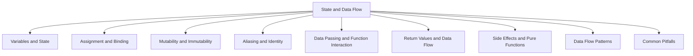

# Chapter 2 --- State and Data Flow

Chapter 1 introduced the mechanics of Python programs: control flow directs execution, exceptions handle failure, functions provide abstraction, and data types give structure to values.

But those mechanics leave a fundamental question unanswered: **how does data move through a program, and how does the program's state change over time?**

This chapter shifts focus from *what Python can do* to *how Python manages data*. The central insight is that Python variables are not containers---they are **names bound to objects**. Understanding this binding model is the key to reasoning about assignment, mutation, aliasing, function arguments, and return values.

The chapter is organized around a progression from simple to complex:

---

## 2.1 Variables and State

The chapter begins with Python's name-binding model. Variables are names that refer to objects, not boxes that hold values. **State** is the collection of all name-to-object bindings at a given point in execution.

## 2.2 Assignment and Binding

Assignment in Python does not copy data---it binds a name to an existing object. This section explores what `=` actually does, how rebinding differs from mutation, and why this distinction matters.

## 2.3 Mutability and Immutability

Some objects can be changed after creation; others cannot. This property---mutability---determines whether operations modify an existing object or produce a new one.

## 2.4 Aliasing and Identity

When two names refer to the same object, changes through one name are visible through the other. This section covers `id()`, the `is` operator, and the difference between identity and equality.

## 2.5 Data Passing and Function Interaction

Python passes arguments by binding function parameters to the caller's objects. Understanding this mechanism explains why functions can sometimes modify their arguments and sometimes cannot.

## 2.6 Return Values and Data Flow

Return values are the primary way data flows out of functions. This section covers single and multiple returns, tuple unpacking, and how return values connect functions into data pipelines.

## 2.7 Side Effects and Pure Functions

Functions that modify external state produce side effects. Pure functions---those with no side effects and deterministic output---are easier to test and reason about. This section explores the spectrum between the two.

## 2.8 Data Flow Patterns

Common patterns for processing data include transforming, filtering, and accumulating. This section compares in-place and functional approaches to these operations.

## 2.9 Common Pitfalls

The binding model creates specific categories of bugs: mutable default arguments, aliasing surprises, and unexpected side effects. Recognizing these patterns helps avoid them.

---

Together, these sections build a coherent model of how Python programs manage data. Mastering this model is the foundation for writing correct, predictable code.
