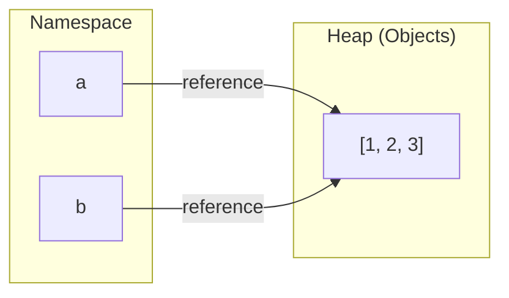

# Variables as Names

## The Mental Model

Most programming introductions describe variables as **boxes that hold values**. In that model, `x = 5` means "put the number 5 into a box labeled x." This metaphor is simple, but it is wrong for Python---and the places where it breaks down are exactly the places where bugs appear.

Python uses a different model: **variables are names bound to objects**. The statement `x = 5` does not put anything into a box. It creates an integer object `5` in memory and attaches the name `x` to it. The name and the object are separate things. The name lives in a namespace; the object lives in memory.

This distinction is not academic. It determines how assignment works, why two variables can share the same object, and when modifying one variable affects another.

In memory, names live in a namespace (on the stack), while objects live on the heap:

```
Namespace (Stack)        Heap (Objects)
┌─────────┐            ┌──────────────────┐
│ x   ────┼───────────▶│ type: <list>     │
└─────────┘            │ value: [1,2,3]   │
                       │ refcount: 1      │
                       └──────────────────┘
```

If you have used a language like C or Java, note the contrast: in those languages, a variable *is* a memory location that holds a value directly. In Python, a variable is just a name that *refers to* an object stored elsewhere. This is why Python assignment behaves differently from assignment in C.

---

## Name Binding with the Assignment Operator

The `=` operator in Python is a **binding operation**, not a storage operation. It makes the left-hand name refer to the right-hand object.

```python
x = 42
```

After this statement, the name `x` is bound to the integer object `42`. No box is created. The object `42` exists independently of the name.

You can verify this by checking the object's identity with `id()`:

```python
x = 42
print(id(x))  # memory address of the object x refers to
```

The value returned by `id()` is the unique identifier of the object in memory during its lifetime. It is not the address of the name `x`---it is the address of the object that `x` currently references.

---

## Names vs Objects

Names and objects have fundamentally different roles:

| Aspect | Name | Object |
|--------|------|--------|
| Where it lives | Namespace (a dictionary) | Memory (the heap) |
| What it stores | A reference to an object | The actual data |
| Created by | Assignment (`=`) | Evaluation of an expression |
| Destroyed when | Deleted or goes out of scope | No more names reference it |

A single object can have **multiple names** bound to it:

```python
a = [1, 2, 3]
b = a
```

After these two statements, `a` and `b` are **different names** referring to the **same object**. There is only one list in memory.

```python
print(a is b)   # True --- same object
print(id(a) == id(b))  # True --- same identity
```

The following diagram illustrates this relationship:



Because `a` and `b` refer to the same list, modifying the list through one name is visible through the other:

```python
a.append(4)
print(b)  # [1, 2, 3, 4]
```

This is not a copy. This is two names sharing one object.

---

## Rebinding vs Mutation

There are two fundamentally different ways to "change" what a name seems to hold:

**Rebinding** changes which object a name refers to. The original object is unaffected.

```python
x = 10
print(id(x))  # id of integer 10

x = 20
print(id(x))  # id of integer 20 --- different object
```

After rebinding, `x` refers to a completely new object. The old object `10` still exists (until Python's garbage collector reclaims it if no other name references it).

**Mutation** changes the internal state of the object itself. The name still refers to the same object.

```python
items = [1, 2, 3]
print(id(items))  # id of the list

items.append(4)
print(id(items))  # same id --- same object, modified in place
```

The difference matters when multiple names share the same object:

```python
a = [1, 2, 3]
b = a

# Rebinding a does NOT affect b
a = [10, 20, 30]
print(b)  # [1, 2, 3] --- b still refers to the original list

# But mutation through a DOES affect b
a = [1, 2, 3]
b = a
a.append(4)
print(b)  # [1, 2, 3, 4] --- same object, seen through both names
```

---

## The id Function and Object Identity

The built-in `id()` function returns an integer that uniquely identifies an object during its lifetime. Two objects that exist simultaneously will have different `id()` values.

```python
x = [1, 2]
y = [1, 2]

print(x == y)       # True --- same value
print(x is y)       # False --- different objects
print(id(x) == id(y))  # False --- different identities
```

Even though `x` and `y` have equal contents, they are separate objects in memory. The `is` operator tests identity (same object), while `==` tests equality (same value).

For small integers and interned strings, Python may reuse the same object for performance. This is an implementation optimization, not something to rely on:

```python
a = 256
b = 256
print(a is b)  # True on CPython (small integer caching)

a = 257
b = 257
print(a is b)  # May be True or False depending on context
```

The lesson: use `==` to compare values. Use `is` only when you specifically need to check whether two names refer to the exact same object.

---

## Why This Model Matters

The name-binding model explains behaviors that the "box" metaphor cannot:

- **Shared references**: two names can refer to the same mutable object, so changes through one affect the other.
- **Function arguments**: passing a list to a function gives the function a new name for the same object, not a copy.
- **Immutability**: operations on integers and strings always produce new objects because the originals cannot be modified.

A useful metaphor: think of names as **post-it notes** stuck on objects. You can stick multiple notes on the same object, move a note to a different object, or peel a note off entirely with `del`:

```python
x = [1, 2, 3]   # stick "x" on the list
y = x            # stick "y" on the same list
del x            # peel "x" off --- the list still exists via y
print(y)         # [1, 2, 3]
```

`del` removes the name, not the object. The object is only destroyed when no names (or other references) point to it.

This model also explains memory efficiency: when multiple names refer to the same large object, Python does not copy the data. A thousand names pointing to the same list use almost no extra memory.

Every topic in this chapter---assignment semantics, mutability, aliasing, function interaction---builds on this single insight: **variables are names, not containers**.

---

## Exercises

**Exercise 1.**
Predict the output of the following code, then explain whether each assignment is a rebinding or a mutation:

```python
x = [10, 20, 30]
y = x
x = x + [40]

print(y)
print(x is y)
```

??? success "Solution to Exercise 1"
    Output:

    ```text
    [10, 20, 30]
    False
    ```

    The statement `x = x + [40]` is a **rebinding**. The `+` operator on lists creates a new list object and binds `x` to that new object. The original list `[10, 20, 30]` is unchanged, and `y` still refers to it.

    After the rebinding, `x` and `y` refer to different objects, so `x is y` is `False`.

    Compare this with `x += [40]`, which for lists calls `list.extend()` and **mutates** the original list in place. In that case, `y` would also see `[10, 20, 30, 40]`.

---

**Exercise 2.**
Two variables are created with the same list content. Predict the output and explain the `id()` results:

```python
a = [1, 2, 3]
b = [1, 2, 3]

print(a == b)
print(a is b)
print(id(a) == id(b))
```

??? success "Solution to Exercise 2"
    Output:

    ```text
    True
    False
    False
    ```

    `a` and `b` are **equal** (`==`) because they contain the same values in the same order. However, they are **not identical** (`is`) because each list literal `[1, 2, 3]` creates a separate object in memory.

    Since they are separate objects, `id(a)` and `id(b)` return different values. Equality compares content; identity compares memory address. Two objects can be equal without being the same object.

---

**Exercise 3.**
Predict the output of the following code and explain what happens at each step:

```python
def add_item(lst, item):
    lst.append(item)
    return lst

original = [1, 2, 3]
result = add_item(original, 4)

print(original)
print(result is original)
```

??? success "Solution to Exercise 3"
    Output:

    ```text
    [1, 2, 3, 4]
    True
    ```

    When `add_item(original, 4)` is called, the parameter `lst` becomes a new name bound to the same list object that `original` refers to. The call `lst.append(item)` **mutates** that shared object in place.

    The function then returns `lst`, which is the same object. So `result` is bound to the very same list object as `original`. That is why `result is original` is `True` and `original` shows the modified content `[1, 2, 3, 4]`.

    This demonstrates the name-binding model in function calls: the function does not receive a copy of the list. It receives a new name for the same object.
