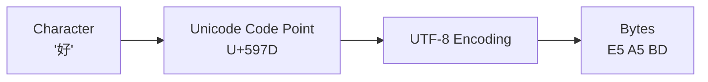
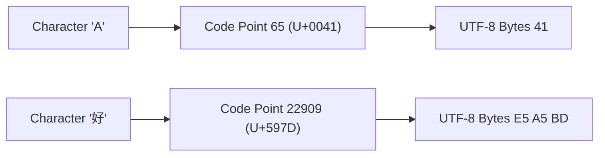

# `str`: ASCII and Unicode

In Python, a string is a sequence of Unicode characters. Python strings represent **Unicode text**, allowing programs to work with characters from almost every writing system in the world.

Understanding how Python represents characters requires three key ideas:

1. **Characters**
2. **Unicode code points**
3. **Encodings**

---

## ASCII

### What is ASCII?

ASCII (American Standard Code for Information Interchange) is a **7-bit character encoding** that maps **128 characters** to integers **0–127**.

Examples:

| Character | Decimal | Hex  |
| --------- | ------- | ---- |
| `'0'`     | 48      | 0x30 |
| `'A'`     | 65      | 0x41 |
| `'a'`     | 97      | 0x61 |

ASCII was originally designed for English text along with control characters. Because it only supports 128 characters, it cannot represent most languages used worldwide.

Today, **ASCII is a subset of Unicode**.

---

## Unicode

Unicode is a character standard that assigns a unique code point to each character.

### Why Unicode Exists

ASCII cannot represent characters used in most languages.

Unicode solves this by assigning a **unique number to every character** across languages and symbol systems. Unicode defines characters and their code points, but it does not define how those characters are stored as bytes. That is the role of encodings such as UTF-8.

Unicode supports:

* Latin alphabets
* Asian writing systems
* mathematical symbols
* emojis
* technical symbols

Example characters from different languages:

```python
def main():
    print(f"{ord('ה') = }")   # Hebrew
    print(f"{ord('ち') = }")  # Japanese
    print(f"{ord('好') = }")  # Chinese
    print(f"{ord('안') = }")  # Korean
    print(f"{ord('😀') = }")  # Emoji

if __name__ == "__main__":
    main()
```

Example output:

```
ord('ה') = 1492
ord('ち') = 12385
ord('好') = 22909
ord('안') = 50504
ord('😀') = 128512
```

---

## Unicode Code Points

Every Unicode character is identified by a **code point**. A code point identifies a character abstractly; the actual visual appearance depends on the font used to render it.

A code point is an integer in the range:

```
U+0000 to U+10FFFF
```

Unicode code points are written in hexadecimal using the `U+` prefix. The `U+` prefix indicates that the hexadecimal number refers to a Unicode code point rather than a generic hexadecimal value.

Examples:

| Character | Decimal | Code Point |
| --------- | ------- | ---------- |
| `'A'`     | 65      | U+0041     |
| `'ñ'`     | 241     | U+00F1     |
| `'好'`     | 22909   | U+597D     |
| `'😀'`    | 128512  | U+1F600    |

You can convert characters to their code points using `ord()`.

```python
def main():
    print(ord('A'))        # 65
    print(ord('好'))       # 22909
    print(hex(ord('好')))  # 0x597d

if __name__ == "__main__":
    main()
```

---

## `ord()` and `chr()`

Python provides two built-in functions for converting between characters and code points.

### `ord()`

Returns the **Unicode code point** of a character.

```python
def main():
    print(f"{ord('A') = }")
    print(f"{ord('a') = }")
    print(f"{ord('好') = }")

if __name__ == "__main__":
    main()
```

Example output:

```
ord('A') = 65
ord('a') = 97
ord('好') = 22909
```

### `chr()`

Performs the inverse operation. It converts a **Unicode code point into a character**.

```python
def main():
    print(f"{chr(65) = }")
    print(f"{chr(22909) = }")
    print(f"{chr(128512) = }")

if __name__ == "__main__":
    main()
```

Example output:

```
chr(65) = 'A'
chr(22909) = '好'
chr(128512) = '😀'
```

---

## Unicode Escape Sequences

Python can represent Unicode characters using **escape sequences**.

Each `X` represents a hexadecimal digit (0–9, A–F).

### 4-digit escape

```
\uXXXX
```

Example:

```python
char1 = "\u03A9"   # Ω
char2 = "\u5B57"   # 字

print(char1, char2)
```

Output:

```
Ω 字
```

### 8-digit escape

```
\UXXXXXXXX
```

Example:

```python
char = "\U0001F600"

print(char)  # 😀
```

---

## Character → Code Point → Encoding

It is important to distinguish **code points from encodings**.

Python strings store **Unicode code points**, not raw bytes.

When text must be written to files or sent over networks, it must be **encoded into bytes**.



Example in Python:

```python
def main():
    s = "好"

    print(ord(s))             # Unicode code point
    print(s.encode("utf-8"))  # encoded bytes

if __name__ == "__main__":
    main()
```

Output:

```
22909
b'\xe5\xa5\xbd'
```

---

## From Characters to Bytes

The entire text pipeline can be seen clearly with two characters.

| Character | Code Point     | UTF-8 Bytes |
| --------- | -------------- | ----------- |
| `'A'`     | 65 (U+0041)    | `41`        |
| `'好'`     | 22909 (U+597D) | `E5 A5 BD`  |



For ASCII characters, the code point value and the UTF-8 byte value are identical. UTF-8 was designed so that all ASCII text is encoded identically, allowing ASCII files to remain valid UTF-8 without modification.

!!! tip "Unicode Mental Model"

    Character → Code Point → Encoding → Bytes

---

## Why UTF-8 Dominates

UTF-8 is the most widely used text encoding on the internet and in modern software systems. It converts Unicode code points into **variable-length byte sequences**.

| Property           | Explanation                                          |
| ------------------ | ---------------------------------------------------- |
| ASCII compatible   | The first 128 characters use the same bytes as ASCII |
| Space efficient    | Common English text uses only 1 byte per character   |
| Universal          | Can encode every Unicode character                   |
| Self-synchronizing | Errors rarely corrupt surrounding text               |

UTF-8 uses **1 to 4 bytes** depending on the character.

| Character Type         | Bytes   |
| ---------------------- | ------- |
| ASCII characters       | 1 byte  |
| European characters    | 2 bytes |
| Most Asian characters  | 3 bytes |
| Emoji and rare symbols | 4 bytes |

Example:

```python
def main():
    print("A".encode("utf-8"))    # 1 byte
    print("ñ".encode("utf-8"))    # 2 bytes
    print("好".encode("utf-8"))   # 3 bytes
    print("😀".encode("utf-8"))  # 4 bytes

if __name__ == "__main__":
    main()
```

Today UTF-8 is the default encoding for the web (HTML, JSON, XML), Linux and macOS systems, Python source files, and most modern databases.

---

## Characters vs Bytes in Python

A common source of confusion is that **characters and bytes are not the same thing**.

In Python:

* `len(str)` counts **Unicode characters (code points)**
* `len(bytes)` counts **bytes**

Example:

```python
def main():
    s = "😀"

    print("string:", s)
    print("len(s):", len(s))
    print("UTF-8 bytes:", s.encode("utf-8"))
    print("len(bytes):", len(s.encode("utf-8")))

if __name__ == "__main__":
    main()
```

Output:

```
string: 😀
len(s): 1
UTF-8 bytes: b'\xf0\x9f\x98\x80'
len(bytes): 4
```

Different encodings may use different numbers of bytes to represent the same character.

| Character | Code Point | UTF-8 Length (bytes) |
| --------- | ---------- | -------------------- |
| `A`       | U+0041     | 1 byte               |
| `ñ`       | U+00F1     | 2 bytes              |
| `好`       | U+597D     | 3 bytes              |
| `😀`      | U+1F600    | 4 bytes              |

---

## `ord()` and `chr()` Relationship

```python
print(ord('A'))   # 65
print(chr(65))    # 'A'
```

---

## Unicode Names

Python can also access the official **Unicode name** of characters.

```python
import unicodedata

def main():
    print(unicodedata.name("好"))
    print(unicodedata.name("😀"))

if __name__ == "__main__":
    main()
```

Output:

```
CJK UNIFIED IDEOGRAPH-597D
GRINNING FACE
```

---

## Key Takeaways

* Python strings store **sequences of Unicode code points**.
* ASCII is the first **128 Unicode characters**.
* Each character has a **Unicode code point**.
* `ord()` converts a character → code point.
* `chr()` converts a code point → character.
* Unicode code points range from **U+0000 to U+10FFFF**.
* Encodings such as **UTF-8** convert code points into **bytes**.


---

## Exercises


**Exercise 1.**
Use `ord()` and `chr()` to convert the character `'A'` to its code point and back. Then do the same for a non-ASCII character like `'\u4e16'` (world in Chinese).

??? success "Solution to Exercise 1"

    ```python
    # ASCII character
    print(ord('A'))    # 65
    print(chr(65))     # A

    # Non-ASCII character
    print(ord('\u4e16'))  # 19990
    print(chr(19990))      # 世
    ```

    `ord()` converts a character to its Unicode code point (an integer). `chr()` converts a code point back to a character.

---

**Exercise 2.**
Write a function `char_info(c)` that takes a single character and prints its Unicode code point (decimal and hex), its UTF-8 byte representation, and the number of UTF-8 bytes it uses.

??? success "Solution to Exercise 2"

    ```python
    def char_info(c):
        code_point = ord(c)
        utf8_bytes = c.encode("utf-8")
        print(f"Character: {c}")
        print(f"Code point: {code_point} (U+{code_point:04X})")
        print(f"UTF-8 bytes: {utf8_bytes}")
        print(f"Byte count: {len(utf8_bytes)}")

    char_info('A')    # 1 byte
    char_info('\u00f1')  # 2 bytes (ñ)
    char_info('\u4e16')  # 3 bytes (世)
    char_info('\U0001F600')  # 4 bytes (emoji)
    ```

    Each character uses 1 to 4 bytes in UTF-8 depending on its code point range.

---

**Exercise 3.**
Demonstrate that `len("Hello")` counts characters while `len("Hello".encode("utf-8"))` counts bytes. Then show a string where these two values differ significantly.

??? success "Solution to Exercise 3"

    ```python
    s = "Hello"
    print(f"Characters: {len(s)}, Bytes: {len(s.encode('utf-8'))}")
    # Characters: 5, Bytes: 5

    s = "\u4f60\u597d\u4e16\u754c"  # 你好世界
    print(f"Characters: {len(s)}, Bytes: {len(s.encode('utf-8'))}")
    # Characters: 4, Bytes: 12
    ```

    ASCII characters use 1 byte each in UTF-8, so character count equals byte count. Chinese characters use 3 bytes each, so 4 characters produce 12 bytes.
