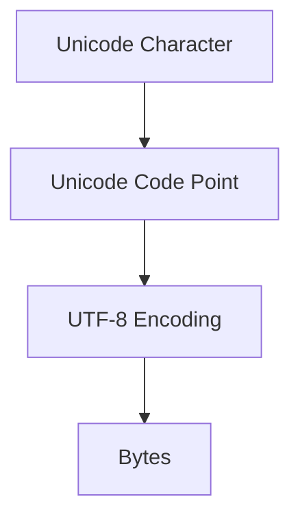

# `str`: UTF-8 Encoding

UTF-8 is a **variable-length encoding** used to convert Unicode characters into bytes.

In the previous section we introduced **Unicode code points**. This section explains how those code points are **encoded into bytes using UTF-8**.



---

## Why UTF-8?

### ASCII Limitations

ASCII supports only **128 characters (0–127)**, which is insufficient for representing most languages.

```python
# ASCII works for English
char = 'A'

# But not for other scripts
char = '好'
```

ASCII cannot represent characters from most writing systems.

---

### UTF-8 Advantages

UTF-8 solves this problem while preserving compatibility with ASCII.

UTF-8 provides:

* **Backward compatibility with ASCII**
* **Compact storage for common characters**
* **Full Unicode support**
* **Self-synchronizing byte sequences**

Because of these properties, UTF-8 has become the **dominant text encoding on the web and in modern systems**.

---

## UTF-8 Encoding Structure

UTF-8 encodes Unicode code points using **1 to 4 bytes**.

| Code Point Range    | Byte Pattern                          | UTF-8 Bytes |
| ------------------- | ------------------------------------- | ----------- |
| U+0000 – U+007F    | `0xxxxxxx`                            | 1     |
| U+0080 – U+07FF    | `110xxxxx 10xxxxxx`                   | 2     |
| U+0800 – U+FFFF    | `1110xxxx 10xxxxxx 10xxxxxx`          | 3     |
| U+10000 – U+10FFFF | `11110xxx 10xxxxxx 10xxxxxx 10xxxxxx` | 4     |

---

## How UTF-8 Packs Bits

UTF-8 encodes a Unicode code point by inserting its binary bits into predefined byte templates.


| Bytes | UTF-8 Pattern                         | Code Point Bits |
| ----- | ------------------------------------- | --------------- |
| 1     | `0xxxxxxx`                            | 7 bits          |
| 2     | `110xxxxx 10xxxxxx`                   | 11 bits         |
| 3     | `1110xxxx 10xxxxxx 10xxxxxx`          | 16 bits         |
| 4     | `11110xxx 10xxxxxx 10xxxxxx 10xxxxxx` | 21 bits         |

The `x` positions are filled with **bits from the Unicode code point**.

---

### Example: Encoding '世'

Unicode code point:

```
U+4E16
```

Binary:

```
0100111000010110
```

Fill into the **3-byte template**:

```
1110xxxx 10xxxxxx 10xxxxxx
```

Result:

```
11100100 10111000 10010110
```

Hex:

```
E4 B8 96
```

---

## Leading Bit Patterns

The **first byte** of a UTF-8 sequence indicates the number of bytes in the encoding.

| Pattern     | Meaning                     |
| ----------- | --------------------------- |
| `0xxxxxxx`  | Single-byte ASCII character |
| `110xxxxx`  | Start of 2-byte sequence    |
| `1110xxxx`  | Start of 3-byte sequence    |
| `11110xxx`  | Start of 4-byte sequence    |
| `10xxxxxx`  | Continuation byte           |

Continuation bytes always start with `10xxxxxx`.

This makes UTF-8 **self-synchronizing**, meaning corrupted bytes rarely affect surrounding characters.

---

## Why Continuation Bytes Start with `10`

A decoder can immediately determine whether a byte is:

* a **single-byte ASCII character**
* the **start of a multi-byte sequence**
* a **continuation byte**

No valid UTF-8 character **starts** with `10`. Because of this rule, a decoder can scan any byte stream and determine where characters begin.

Example byte sequence:

```
11100100 10111000 10010110
```

Breakdown:

```
11100100   → start of 3-byte sequence
10111000   → continuation
10010110   → continuation
```

This represents the character `'世'`.

If a byte is corrupted, the decoder can resynchronize quickly because valid continuation bytes must start with `10xxxxxx`.

UTF-8 continuation bytes always begin with `10`, allowing decoders to reliably detect character boundaries.

---

## Encoding Examples

### ASCII Character

ASCII characters remain **identical in UTF-8**.

```
'A' → U+0041 → 01000001
```

This uses **1 byte**.

---

### Accented Character

```
'ñ' → U+00F1 → 11000011 10110001
```

This uses **2 bytes**.

---

### Chinese Character

```
'世' → U+4E16 → 11100100 10111000 10010110
```

UTF-8 bytes:

```
E4 B8 96
```

---

### Musical Symbol (Supplementary Plane)

```
'𝄞' → U+1D11E → 11110000 10011101 10000100 10011110
```

This uses **4 bytes**.

---

## UTF-8 Encoding in Python

Python provides built-in methods for converting strings into UTF-8 bytes.

```python
def main():
    text = "A ñ 世 😀"

    encoded = text.encode("utf-8")

    print("string:", text)
    print("bytes:", encoded)
    print("byte values:", list(encoded))

if __name__ == "__main__":
    main()
```

Example output:

```
string: A ñ 世 😀
bytes: b'A \xc3\xb1 \xe4\xb8\x96 \xf0\x9f\x98\x80'
byte values: [65, 32, 195, 177, 32, 228, 184, 150, 32, 240, 159, 152, 128]
```

---

## Comparison with Other Encodings

| Encoding | Bytes per Character | Typical Use                |
| -------- | ------------------- | -------------------------- |
| UTF-8    | 1–4                 | Web, Linux, modern systems |
| UTF-16   | 2–4                 | Windows, Java              |
| UTF-32   | 4                   | Internal processing        |
| ASCII    | 1                   | English text               |

---

## ASCII Is a Subset of UTF-8

UTF-8 was designed so that **all ASCII characters remain unchanged**.

The ASCII range (U+0000 – U+007F) is encoded in UTF-8 using **exactly one byte**, with the same value as ASCII.

| Character | ASCII | UTF-8 |
| --------- | ----- | ----- |
| `A`       | `41`  | `41`  |
| `0`       | `30`  | `30`  |
| `!`       | `21`  | `21`  |

So an ASCII file is already a valid UTF-8 file.

```python
def main():
    text = "Hello"

    print(text.encode("ascii"))
    print(text.encode("utf-8"))

if __name__ == "__main__":
    main()
```

Output:

```
b'Hello'
b'Hello'
```

The byte sequences are **identical**.

UTF-8 was designed so that the entire ASCII character set is encoded identically, making every ASCII file a valid UTF-8 file.

---

## Why Python Uses UTF-8 by Default

Python 3 adopted **UTF-8 as the default source encoding** (PEP 3120).

In Python 2, source files were typically interpreted as ASCII, and non-ASCII characters required an explicit encoding declaration:

```python
# -*- coding: utf-8 -*-
name = "José"
```

In Python 3, UTF-8 is the default. Unicode characters can appear directly in code:

```python
name = "José"
greeting = "你好"
emoji = "😀"

print(name, greeting, emoji)
```

No special encoding declaration is required.

In Python 3:

* `str` objects represent **Unicode text**
* `bytes` represent **encoded binary data**

Typical workflow:

```
text (str) → encode → bytes
bytes → decode → text (str)
```

---

## Key Takeaways

* UTF-8 converts Unicode code points into **bytes**.
* UTF-8 uses **1–4 bytes per character**.
* ASCII characters remain **single-byte in UTF-8**.
* Leading bits identify the **length of the sequence**.
* Continuation bytes start with `10`, enabling **self-synchronization**.
* ASCII is a **subset of UTF-8**.
* Python 3 uses **UTF-8 as the default source encoding**.
* UTF-8 is the **most widely used text encoding today**.


---

## Exercises


**Exercise 1.**
Encode the string `"A \u00f1 \u4e16 \U0001F600"` in UTF-8 and print the list of byte values. Identify which bytes belong to each character.

??? success "Solution to Exercise 1"

    ```python
    text = "A \u00f1 \u4e16 \U0001F600"
    encoded = text.encode("utf-8")

    print(f"String: {text}")
    print(f"Bytes: {list(encoded)}")
    # A: [65], space: [32], ñ: [195, 177], space: [32],
    # 世: [228, 184, 150], space: [32], 😀: [240, 159, 152, 128]
    ```

    ASCII characters use 1 byte, `\u00f1` uses 2 bytes, `\u4e16` uses 3 bytes, and the emoji uses 4 bytes.

---

**Exercise 2.**
Write a function `utf8_byte_count(s)` that returns a dictionary mapping each character in the string to the number of UTF-8 bytes it uses. Test with a string containing ASCII, European, Asian, and emoji characters.

??? success "Solution to Exercise 2"

    ```python
    def utf8_byte_count(s):
        return {c: len(c.encode("utf-8")) for c in s}

    result = utf8_byte_count("A\u00f1\u4e16\U0001F600")
    for char, count in result.items():
        print(f"'{char}' (U+{ord(char):04X}): {count} bytes")
    ```

    Each character is encoded individually, and the length of the resulting bytes object gives the UTF-8 byte count.

---

**Exercise 3.**
Demonstrate that an ASCII-encoded file is also valid UTF-8 by encoding `"Hello"` with both `"ascii"` and `"utf-8"` codecs and showing the byte sequences are identical.

??? success "Solution to Exercise 3"

    ```python
    text = "Hello"

    ascii_bytes = text.encode("ascii")
    utf8_bytes = text.encode("utf-8")

    print(f"ASCII: {ascii_bytes}")
    print(f"UTF-8: {utf8_bytes}")
    print(f"Identical: {ascii_bytes == utf8_bytes}")  # True
    ```

    UTF-8 was designed so that all ASCII characters (U+0000 to U+007F) are encoded using the exact same single-byte values as ASCII.
