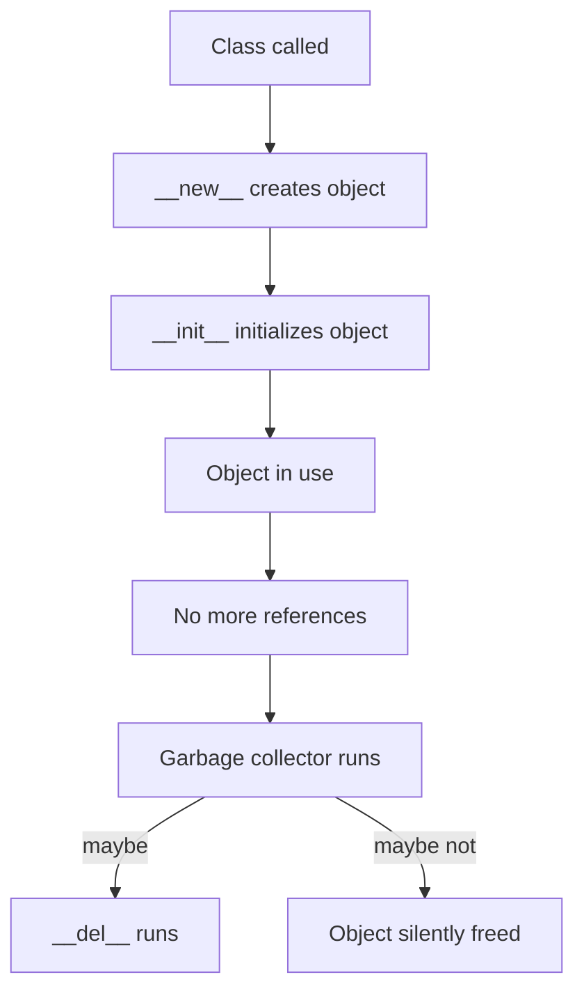

# Constructor and Destructor

`__init__` (initializer) and `__del__` (destructor) manage object lifecycle in Python. Despite common usage, `__init__` is not the true constructor — `__new__` is. Understanding when each runs — and when `__del__` does not — is essential for writing reliable classes.

---

## Object Lifecycle

Every Python object follows a predictable lifecycle: creation, initialization, use, and eventual destruction. `__new__` always runs at creation; `__init__` runs only if `__new__` returns a proper instance of the class. The destructor (`__del__`) does not guarantee teardown.



!!! tip "Core Insight"
    `__new__` creates the object and `__init__` initializes it — both are deterministic. `__del__` is non-deterministic — it may or may not run, and you cannot control when. Design accordingly.

---

## Initializer: `__init__`

### 1. Purpose

Initializes new objects immediately after `__new__` creates them. Despite being commonly called the "constructor," `__init__` does not construct the object — it receives an already-created instance and sets up its attributes.

```python
class Student:
    def __init__(self, name, major):
        self.name = name
        self.major = major

alice = Student("Alice", "Math")
```

### 2. Automatic Call

Python automatically calls `__init__` during instantiation.

```python
# These are equivalent:
a = Student("Lee", "Math")
# Student.__init__(a, "Lee", "Math")
```

### 3. Why It Matters

Every class should define `__init__` for clarity. Without it, attributes must be assigned dynamically — leading to fragile, error-prone code.

---

## Without `__init__`

### 1. Dynamic Assignment

```python
class Student:
    pass

a = Student()
a.name = "Lee"
a.major = "Math"
```

### 2. Problems

- No enforcement of required fields
- Runtime errors from typos
- Unclear object requirements
- Violates encapsulation

### 3. Fragile Code

```python
b = Student()
b.name = "Kim"
# Forgot to set major!
print(b.major)  # AttributeError
```

---

## `__init__` Patterns

### 1. Simple Assignment

```python
class Car:
    def __init__(self, speed, color):
        self.speed = speed
        self.color = color
```

### 2. With Defaults

```python
class Car:
    def __init__(self, speed=0, color="black"):
        self.speed = speed
        self.color = color
```

### 3. With Validation

```python
class Student:
    def __init__(self, name, major):
        if not name:
            raise ValueError("Name required")
        self.name = name
        self.major = major
```

---

## The True Constructor: `__new__`

When you call `Student("Alice", "Math")`, Python performs two steps internally. First `__new__` creates the object, then `__init__` initializes it.

### 1. Two-Step Process

```python
class Demo:
    def __new__(cls, *args, **kwargs):
        print("Creating instance (__new__)")
        return super().__new__(cls)

    def __init__(self):
        print("Initializing instance (__init__)")

d = Demo()
# Creating instance (__new__)
# Initializing instance (__init__)
```

### 2. Why `__new__` Uses `cls`, Not `self`

`__new__` receives the **class** as its first argument because no instance exists yet — it is the method responsible for creating one. Using `cls` makes this explicit. Writing `self` would be misleading: the first argument is the class object, not an instance.

| Method | First argument | What it receives |
|---|---|---|
| `__new__` | `cls` | The class being instantiated |
| `__init__` | `self` | The instance being initialized |

### 3. When to Override `__new__`

`__new__` behaves like a class method (it receives `cls`), but does **not** require the `@classmethod` decorator — Python treats it as a special hook in the object creation protocol. Most classes never need to override `__new__`. Use it only when you need to control object creation itself:

**Immutable type subclasses** — values must be set before the object exists:

```python
class UpperStr(str):
    def __new__(cls, value):
        return super().__new__(cls, value.upper())

s = UpperStr("hello")
print(s)  # HELLO — cannot do this in __init__
```

**Singleton pattern** — only one instance ever exists:

```python
class Singleton:
    _instance = None

    def __new__(cls):
        if cls._instance is None:
            cls._instance = super().__new__(cls)
        return cls._instance
```

Think of it as: `__new__` decides *what object exists*; `__init__` decides *how it is configured*. In 99% of classes, `__init__` alone is enough.

---

## Introspection with `vars()`

### 1. View Attributes

```python
alice = Student("Alice", "Statistics")
print(vars(alice))
# {'name': 'Alice', 'major': 'Statistics'}
```

### 2. `vars()` vs `__dict__`

For simple objects, `vars(obj)` and `obj.__dict__` return the same result — but they serve different abstraction levels. `vars()` is the public interface; `__dict__` is the implementation detail. This follows Python's design pattern of separating interface from mechanism (`len()` vs `__len__()`, `str()` vs `__str__()`).

```python
print(alice.__dict__)       # Same output as vars(alice) for simple objects
print(vars() )              # Works in local scope too — no __dict__ equivalent
```

### 3. When to Use Which

Use `vars()` for general debugging and introspection. Use `__dict__` only when you need direct access to the internal attribute storage — such as metaprogramming or dynamically injecting attributes. Some objects (those using `__slots__`) have no `__dict__` at all.

---

## Destructor: `__del__`

Most Python developers never use `__del__` directly. It exists for resource cleanup, but Python does not guarantee that `__del__` will ever run — not just that timing is unpredictable, but that it may never execute at all. If program correctness depends on cleanup, never rely on `__del__`.

### 1. Basic Syntax

```python
class IceCream:
    def __init__(self, name, price):
        self.name = name
        self.price = price
        print(f"{self.name} created")
    
    def __del__(self):
        print(f"{self.name} destroyed")
```

### 2. Reference Counting

`__del__` runs only when the last reference is removed.

```python
obj1 = IceCream("Cone", 1500)
obj2 = obj1  # Two references
del obj1     # __del__ NOT called yet
del obj2     # Now __del__ is called
```

### 3. Why It Fails

`__del__` can fail to run in several common scenarios:

- **Circular references**: objects referencing each other may never be collected
- **Program exit**: Python may skip `__del__` entirely at interpreter shutdown
- **Multiple references**: the object lives as long as any reference exists

```python
class Node:
    def __init__(self, value):
        self.value = value
        self.next = None

a = Node(1)
b = Node(2)
a.next = b
b.next = a  # Circular reference — destructors may never run
```

Creation is explicit and guaranteed; destruction is implicit and best-effort.

---

## Proper Cleanup: Context Managers

Since `__del__` is unreliable, Python provides context managers for deterministic resource cleanup.

### 1. The `with` Statement

```python
class FileHandler:
    def __enter__(self):
        self.file = open("data.txt", "w")
        return self.file
    
    def __exit__(self, exc_type, exc_val, exc_tb):
        self.file.close()

with FileHandler() as f:
    f.write("data")
# Guaranteed cleanup — even if an exception occurs
```

### 2. Explicit Close Methods

```python
class Resource:
    def __init__(self):
        self.resource = acquire_resource()
    
    def close(self):
        release_resource(self.resource)

r = Resource()
try:
    pass  # Use resource
finally:
    r.close()
```

### 3. `contextlib`

```python
from contextlib import contextmanager

@contextmanager
def managed_resource():
    resource = acquire_resource()
    try:
        yield resource
    finally:
        release_resource(resource)
```

---

## Key Takeaways

- `__new__` creates the object; `__init__` initializes it — know the difference.
- Always define `__init__` to enforce required fields and validate input.
- `vars()` and `__dict__` inspect object state for debugging.
- `__del__` is non-deterministic — never rely on it for critical cleanup.
- Use context managers (`with` statement) for guaranteed resource management.

---

## Exercises

**Exercise 1.**
Create a `FileHandler` class whose `__init__` takes a filename and opens it in write mode. Add a `write(text)` method. Implement `__del__` to close the file and print a message. Show the lifecycle by creating an instance, writing, and deleting it. Discuss why `__del__` is unreliable compared to context managers.

??? success "Solution to Exercise 1"

        class FileHandler:
            def __init__(self, filename):
                self.filename = filename
                self.file = open(filename, 'w')
                print(f"Opened {filename}")

            def write(self, text):
                self.file.write(text)

            def __del__(self):
                if not self.file.closed:
                    self.file.close()
                    print(f"Closed {self.filename}")

        # Lifecycle demo
        fh = FileHandler("/tmp/test_lifecycle.txt")
        fh.write("Hello")
        del fh  # Closed /tmp/test_lifecycle.txt

        # __del__ is unreliable because:
        # 1. Timing of garbage collection is unpredictable
        # 2. May not run if interpreter crashes
        # 3. Context managers provide deterministic cleanup

---

**Exercise 2.**
Write a `ConnectionPool` class whose `__init__` creates a list of N simulated connections (just strings). Add a `get_connection()` method (pops from the list) and `__del__` that prints how many connections were not returned. Create a pool of 3, take 2, and delete the pool.

??? success "Solution to Exercise 2"

        class ConnectionPool:
            def __init__(self, size):
                self.connections = [f"conn_{i}" for i in range(size)]
                self.total = size
                print(f"Pool created with {size} connections")

            def get_connection(self):
                if self.connections:
                    return self.connections.pop()
                raise RuntimeError("No connections available")

            def __del__(self):
                unreturned = self.total - len(self.connections)
                if unreturned:
                    print(f"Warning: {unreturned} connections were not returned")

        pool = ConnectionPool(3)
        c1 = pool.get_connection()
        c2 = pool.get_connection()
        del pool  # Warning: 2 connections were not returned

---

**Exercise 3.**
Design a `Timer` class where `__init__` records the start time. Add an `elapsed()` method returning seconds since creation. Implement the class as a context manager (`__enter__` returns self, `__exit__` prints elapsed time). Show both usage patterns: manual `elapsed()` calls and `with` statement.

??? success "Solution to Exercise 3"

        import time

        class Timer:
            def __init__(self):
                self.start = time.time()

            def elapsed(self):
                return time.time() - self.start

            def __enter__(self):
                return self

            def __exit__(self, *args):
                print(f"Elapsed: {self.elapsed():.4f}s")
                return False

        # Manual usage
        t = Timer()
        time.sleep(0.1)
        print(f"Manual: {t.elapsed():.4f}s")

        # Context manager usage
        with Timer() as t:
            time.sleep(0.1)

---

**Exercise 4.**
Explain why `__init__` is called an "initializer" rather than a "constructor" in Python. What actually constructs the object, and when does `__init__` receive it? How does this distinction matter in practice?

??? success "Solution to Exercise 4"

        # In Python, the true constructor is __new__, not __init__.
        #
        # __new__ creates and returns the new object instance.
        # __init__ receives the already-created instance (self) and
        # sets up its attributes.
        #
        # The call MyClass(args) does two things:
        #   1. obj = MyClass.__new__(MyClass)   — creates the object
        #   2. obj.__init__(args)               — initializes its state
        #
        # This distinction matters because:
        # - __new__ controls object creation (useful for singletons,
        #   immutable types like int/str subclasses)
        # - __init__ only configures an already-existing object
        # - If __new__ returns an instance of a different class,
        #   __init__ is not called at all
        #
        # For most classes, you only need __init__. Override __new__
        # only when you need to control the creation step itself.
