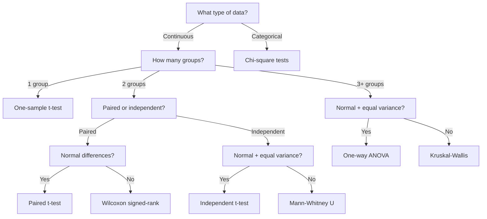

# Test Selection Guide

Choosing the right statistical test depends on the research question, the type of data, and whether the underlying assumptions are met. A mismatched test can produce misleading p-values and invalid conclusions. This guide provides a structured approach to selecting among the tests covered in this chapter.

## Decision Criteria

Before selecting a test, answer these four questions:

1. **What is the research question?** Are you comparing group means, testing distributional fit, or assessing association between categorical variables?
2. **How many groups or samples?** One sample, two samples (paired or independent), or three or more?
3. **What type of data?** Continuous (interval/ratio) or categorical (nominal/ordinal)?
4. **Are parametric assumptions met?** Specifically, are the data approximately normal and do the groups have equal variances?

## Comparing Means

| Scenario | Parametric Test | Non-Parametric Alternative |
|---|---|---|
| One sample vs known mean | One-sample t-test (`ttest_1samp`) | Wilcoxon signed-rank (`wilcoxon`) |
| Two independent samples | Independent t-test (`ttest_ind`) | Mann-Whitney U (`mannwhitneyu`) |
| Two paired samples | Paired t-test (`ttest_rel`) | Wilcoxon signed-rank (`wilcoxon`) |
| Three or more independent groups | One-way ANOVA (`f_oneway`) | Kruskal-Wallis (`kruskal`) |

Use the parametric test when the normality assumption holds (check with Shapiro-Wilk or QQ plots) and variances are approximately equal (check with Levene's test). Switch to the non-parametric alternative when these assumptions are violated or when sample sizes are small.

## Testing Distributional Fit

| Question | Test | SciPy Function |
|---|---|---|
| Does data follow a specific distribution? | Kolmogorov-Smirnov | `kstest` |
| Does data follow a specific distribution (tail-sensitive)? | Anderson-Darling | `anderson` |
| Do categorical counts match expected frequencies? | Chi-square goodness-of-fit | `chisquare` |
| Is data normally distributed? | Shapiro-Wilk | `shapiro` |
| Is data normally distributed (skew/kurtosis)? | D'Agostino-Pearson | `normaltest` |

!!! tip "Goodness-of-Fit vs Normality Tests"
    Normality tests (Shapiro-Wilk, D'Agostino-Pearson) are specialized goodness-of-fit tests designed exclusively for the normal distribution. For testing fit to other distributions (exponential, uniform, etc.), use the KS or Anderson-Darling test with the appropriate reference distribution.

## Categorical Data

| Question | Test | SciPy Function |
|---|---|---|
| Do observed counts match expected proportions? | Chi-square goodness-of-fit | `chisquare` |
| Are two categorical variables independent? | Chi-square test of independence | `chi2_contingency` |

## Variance Assumptions

Before running parametric tests that assume equal variances, verify this assumption:

| Test | SciPy Function | Assumption |
|---|---|---|
| Levene's test | `levene` | Robust to non-normality |
| Bartlett's test | `bartletttest` | Requires normality |

If equal variances are rejected, use Welch's t-test (`ttest_ind` with `equal_var=False`) for two groups, or Welch's ANOVA for multiple groups.

## Decision Flowchart

## Summary

Test selection follows a systematic path from research question to appropriate method. The primary branching points are data type (continuous vs categorical), number of groups, sample pairing, and whether parametric assumptions hold. When in doubt about normality or equal variances, non-parametric tests provide a safer alternative at the cost of some statistical power.
