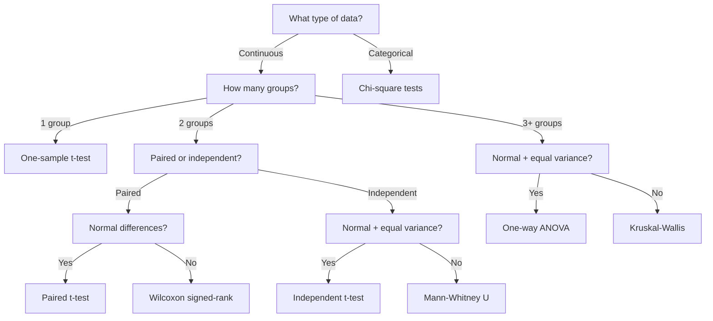

# Test Selection Guide

Choosing the right statistical test depends on the research question, the type of data, and whether the underlying assumptions are met. A mismatched test can produce misleading p-values and invalid conclusions. This guide provides a structured approach to selecting among the tests covered in this chapter.

## Decision Criteria

Before selecting a test, answer these four questions:

1. **What is the research question?** Are you comparing group means, testing distributional fit, or assessing association between categorical variables?
2. **How many groups or samples?** One sample, two samples (paired or independent), or three or more?
3. **What type of data?** Continuous (interval/ratio) or categorical (nominal/ordinal)?
4. **Are parametric assumptions met?** Specifically, are the data approximately normal and do the groups have equal variances?

## Comparing Means

| Scenario | Parametric Test | Non-Parametric Alternative |
|---|---|---|
| One sample vs known mean | One-sample t-test (`ttest_1samp`) | Wilcoxon signed-rank (`wilcoxon`) |
| Two independent samples | Independent t-test (`ttest_ind`) | Mann-Whitney U (`mannwhitneyu`) |
| Two paired samples | Paired t-test (`ttest_rel`) | Wilcoxon signed-rank (`wilcoxon`) |
| Three or more independent groups | One-way ANOVA (`f_oneway`) | Kruskal-Wallis (`kruskal`) |

Use the parametric test when the normality assumption holds (check with Shapiro-Wilk or QQ plots) and variances are approximately equal (check with Levene's test). Switch to the non-parametric alternative when these assumptions are violated or when sample sizes are small.

## Testing Distributional Fit

| Question | Test | SciPy Function |
|---|---|---|
| Does data follow a specific distribution? | Kolmogorov-Smirnov | `kstest` |
| Does data follow a specific distribution (tail-sensitive)? | Anderson-Darling | `anderson` |
| Do categorical counts match expected frequencies? | Chi-square goodness-of-fit | `chisquare` |
| Is data normally distributed? | Shapiro-Wilk | `shapiro` |
| Is data normally distributed (skew/kurtosis)? | D'Agostino-Pearson | `normaltest` |

!!! tip "Goodness-of-Fit vs Normality Tests"
    Normality tests (Shapiro-Wilk, D'Agostino-Pearson) are specialized goodness-of-fit tests designed exclusively for the normal distribution. For testing fit to other distributions (exponential, uniform, etc.), use the KS or Anderson-Darling test with the appropriate reference distribution.

## Categorical Data

| Question | Test | SciPy Function |
|---|---|---|
| Do observed counts match expected proportions? | Chi-square goodness-of-fit | `chisquare` |
| Are two categorical variables independent? | Chi-square test of independence | `chi2_contingency` |

## Variance Assumptions

Before running parametric tests that assume equal variances, verify this assumption:

| Test | SciPy Function | Assumption |
|---|---|---|
| Levene's test | `levene` | Robust to non-normality |
| Bartlett's test | `bartletttest` | Requires normality |

If equal variances are rejected, use Welch's t-test (`ttest_ind` with `equal_var=False`) for two groups, or Welch's ANOVA for multiple groups.

## Decision Flowchart



## Summary

Test selection follows a systematic path from research question to appropriate method. The primary branching points are data type (continuous vs categorical), number of groups, sample pairing, and whether parametric assumptions hold. When in doubt about normality or equal variances, non-parametric tests provide a safer alternative at the cost of some statistical power.

---

## Runnable Example: `solutions_tests.py`

```python
"""
Solutions 03: Statistical Hypothesis Tests
==========================================
Detailed solutions with interpretations.
"""

import numpy as np
from scipy import stats

# =============================================================================
# Main
# =============================================================================

if __name__ == "__main__":

    print("="*80)
    print("SOLUTIONS: STATISTICAL TESTS")
    print("="*80)
    print()

    # Solution 1
    print("Solution 1: Comparing Two Teaching Methods")
    print("-" * 40)

    method_A = np.array([78, 82, 75, 88, 72, 90, 85, 77, 83, 79])
    method_B = np.array([85, 88, 91, 84, 89, 92, 87, 90, 86, 93])

    print("Step 1: State hypotheses")
    print("  H₀: μ_A = μ_B (no difference)")
    print("  H₁: μ_A ≠ μ_B (significant difference)\n")

    # Part a: t-test
    t_stat, p_value = stats.ttest_ind(method_A, method_B)
    print(f"a) Two-sample t-test:")
    print(f"   t-statistic = {t_stat:.4f}")
    print(f"   p-value = {p_value:.4f}")

    alpha = 0.05
    if p_value < alpha:
        print(f"   Decision: Reject H₀ (p < {alpha})")
        print(f"   Conclusion: Method B produces significantly higher scores\n")
    else:
        print(f"   Decision: Fail to reject H₀\n")

    # Part b: Effect size
    mean_diff = np.mean(method_B) - np.mean(method_A)
    pooled_std = np.sqrt(((len(method_A)-1)*np.var(method_A, ddof=1) +
                          (len(method_B)-1)*np.var(method_B, ddof=1)) /
                         (len(method_A) + len(method_B) - 2))
    cohens_d = mean_diff / pooled_std

    print(f"b) Cohen\'s d = {cohens_d:.4f}")
    if abs(cohens_d) > 0.8:
        print(f"   Interpretation: Large effect size\n")

    # Part c: Confidence interval
    se_diff = pooled_std * np.sqrt(1/len(method_A) + 1/len(method_B))
    df = len(method_A) + len(method_B) - 2
    t_critical = stats.t.ppf(0.975, df)
    margin = t_critical * se_diff

    print(f"c) 95% CI for difference: [{mean_diff - margin:.2f}, {mean_diff + margin:.2f}]")
    print(f"   We are 95% confident the true difference is in this range\n")

    # Detailed solutions continue...
    print("="*80)
```

---

## Exercises

**Exercise 1.**
Given the following dataset, choose and apply the appropriate test: two independent groups of exam scores, Group A (n=8) has a skewed distribution, Group B (n=10) is roughly normal. Justify your choice.

??? success "Solution to Exercise 1"

        import numpy as np
        from scipy import stats

        np.random.seed(42)
        a = np.random.exponential(5, 8)   # skewed
        b = np.random.normal(10, 3, 10)   # normal

        _, p_norm_a = stats.shapiro(a)
        print(f"Shapiro-Wilk for A: p={p_norm_a:.4f}")
        print("Group A is skewed -> use Mann-Whitney U")

        u, p = stats.mannwhitneyu(a, b, alternative='two-sided')
        print(f"Mann-Whitney U: U={u:.4f}, p={p:.4f}")

---

**Exercise 2.**
A researcher has three groups of continuous measurements. First check normality (Shapiro-Wilk) and equal variance (Levene's test) for each group. Based on the results, decide whether to use ANOVA or Kruskal-Wallis.

??? success "Solution to Exercise 2"

        import numpy as np
        from scipy import stats

        np.random.seed(42)
        g1 = np.random.normal(50, 5, 25)
        g2 = np.random.exponential(50, 25)  # non-normal
        g3 = np.random.normal(55, 5, 25)

        for name, g in [("G1", g1), ("G2", g2), ("G3", g3)]:
            _, p = stats.shapiro(g)
            print(f"{name} Shapiro p={p:.4f}", end="")
            print(f" {'(normal)' if p > 0.05 else '(NOT normal)'}")

        _, p_lev = stats.levene(g1, g2, g3)
        print(f"Levene p={p_lev:.4f}")
        print("G2 is non-normal -> use Kruskal-Wallis")

        h, p = stats.kruskal(g1, g2, g3)
        print(f"Kruskal-Wallis: H={h:.4f}, p={p:.4f}")

---

**Exercise 3.**
Given a contingency table of treatment outcomes across three hospitals, select the appropriate test, apply it, and compute an effect size measure.

??? success "Solution to Exercise 3"

        import numpy as np
        from scipy import stats

        table = np.array([[50, 30], [45, 35], [60, 20]])
        chi2, p, dof, expected = stats.chi2_contingency(table)
        n = table.sum()
        v = np.sqrt(chi2 / (n * (min(table.shape) - 1)))
        print(f"Chi-square independence test: chi2={chi2:.4f}, p={p:.4f}")
        print(f"Cramer's V = {v:.4f}")
